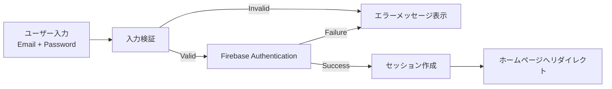
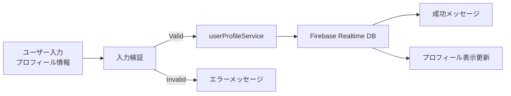
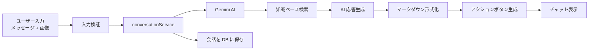
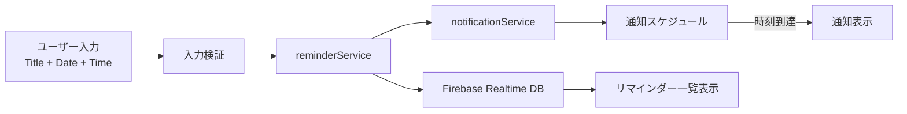
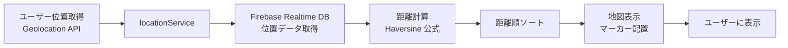
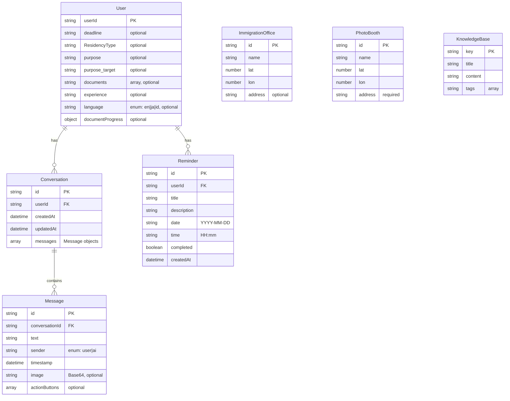
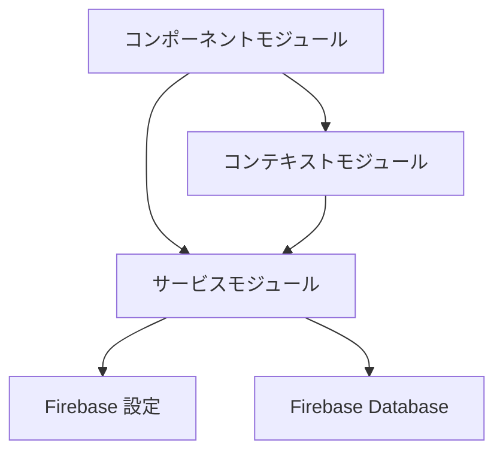
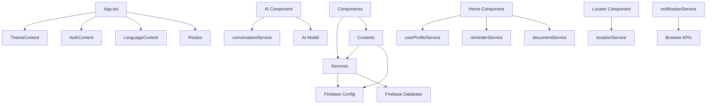
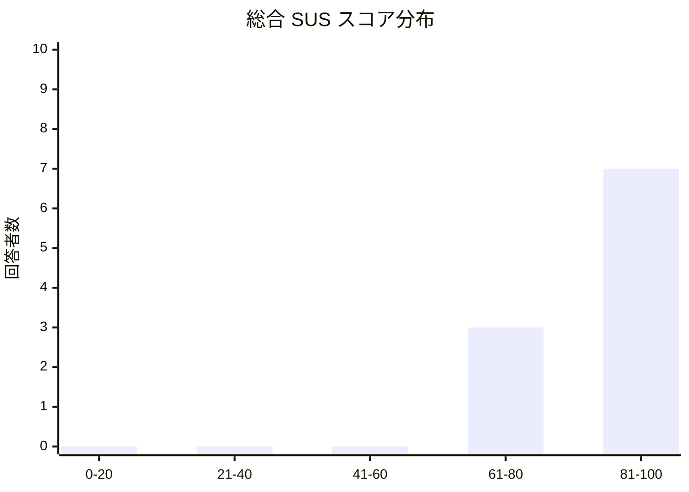
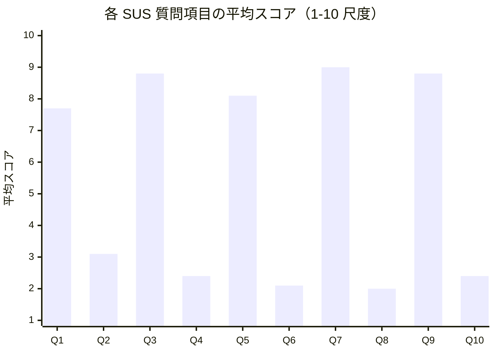

# Vizy 要件定義書

## 1. システム概要

### 1.1 アプリケーション名

Vizy

### 1.2 システムの目的

Vizy は、日本の在留資格（ビザ）延長申請プロセスを支援する Progressive Web Application (PWA)である。本システムは、在留資格延長申請に必要な書類の管理、AI を活用したフォーム入力支援、入国管理局や証明写真ブースの位置情報提供、リマインダー機能などを統合的に提供し、申請プロセスの効率化とユーザーの負担軽減を目的とする。

### 1.3 主要機能の概要

- ユーザー認証機能（Firebase Authentication）
- AI フォームアシスタント（Gemini 2.5 Flash モデル使用）
- ドキュメント管理システム（18 種類の書類タイプ対応）
- 位置情報サービス（入国管理局・証明写真ブース検索）
- ユーザープロフィール管理
- リマインダー・通知機能
- 多言語対応（英語、日本語、インドネシア語）
- 設定機能（アカウント、プライバシー、アクセシビリティ、ヘルプ）
- PWA 機能（インストール、サービスワーカー、オフライン対応準備）

---

## 2. 目的・背景

### 2.1 問題提起

日本の在留資格延長申請は、複雑な書類準備、正確なフォーム記入、期限管理など、多くの課題を抱えている。特に、外国人居住者にとって言語の壁や手続きの複雑さが大きな障壁となっている。

### 2.2 解決すべき課題

1. **書類管理の複雑さ**: 在留資格タイプごとに異なる必要書類の把握と管理
2. **フォーム入力の困難**: 日本語での正確な記入、各項目の意味理解
3. **情報アクセスの困難**: 入国管理局の場所、証明写真ブースの検索
4. **期限管理**: ビザ期限や申請期限の見落とし防止
5. **言語障壁**: 多様な言語背景を持つユーザーへの対応

### 2.3 ターゲットユーザー

- 日本の在留資格延長申請を行う外国人居住者
- 在留資格タイプ: 就労ビザ、留学ビザ、家族滞在ビザ、特定技能ビザ
- 言語: 英語、日本語、インドネシア語を話すユーザー

---

## 3. 機能要件

### 3.1 認証機能

#### 3.1.1 ユーザー登録

- **要件**: 新規ユーザーがメールアドレスとパスワードでアカウントを作成できる
- **実装**: Firebase Authentication を使用したメール/パスワード認証
- **入力項目**: メールアドレス、パスワード（確認含む）
- **検証**: メールアドレス形式、パスワード強度、重複チェック

#### 3.1.2 ログイン

- **要件**: 登録済みユーザーがメールアドレスとパスワードでログインできる
- **実装**: Firebase Authentication による認証
- **エラーハンドリング**: 無効な認証情報、アカウント不存在の適切な通知

#### 3.1.3 保護されたルート

- **要件**: 認証済みユーザーのみが主要機能にアクセスできる
- **実装**: ProtectedRoute コンポーネントによる認証状態チェック
- **未認証時の動作**: ログインページへリダイレクト

#### 3.1.4 ログアウト

- **要件**: ユーザーがセッションを終了できる
- **実装**: Firebase Authentication の signOut メソッド
- **動作**: 認証状態のクリアとログインページへの遷移

### 3.2 AI フォームアシスタント

#### 3.2.1 チャットボットインターフェース

- **要件**: ユーザーが自然言語で質問し、AI が回答を提供する
- **実装**: Gemini 2.5 Flash モデルを使用した会話型インターフェース
- **UI**: メッセージ履歴表示、入力フィールド、送信ボタン
- **機能**: リアルタイム応答、マークダウン形式の回答表示

#### 3.2.2 ビザ申請フォームの段階的支援

- **要件**: フォーム各項目について、AI が説明と記入例を提供する
- **知識ベース**: knowledge.json ファイルに格納された 472 項目の知識データ
- **対応項目**: 日付形式、名前記入、住所形式、パスポート番号、電話番号、国籍、生年月日、性別、婚姻状況など
- **動作**: ユーザーの質問に基づき、関連する知識を検索して回答

#### 3.2.3 会話履歴管理

- **要件**: 過去の会話を保存・閲覧・削除できる
- **実装**: Firebase Realtime Database に会話データを保存
- **データ構造**: 会話 ID、メッセージ配列、作成日時、更新日時
- **機能**: 会話一覧表示、会話の再開、会話の削除

#### 3.2.4 画像アップロード対応

- **要件**: ユーザーが画像をアップロードし、AI が画像内容を分析して回答できる
- **実装**: カメラ撮影またはファイル選択による画像アップロード
- **処理**: 画像を Base64 エンコードして AI モデルに送信
- **用途**: フォーム項目の確認、書類の確認など

#### 3.2.5 アクションボタンによるナビゲーション

- **要件**: AI の回答に基づき、関連するページへのナビゲーションボタンを表示
- **実装**: アクションボタンコンポーネントによる動的ボタン生成
- **機能**: ドキュメントページ、設定ページ、その他関連機能への直接遷移

#### 3.2.6 ウェルカムポップアップ

- **要件**: 初回利用時に AI アシスタントの機能説明を表示
- **内容**: フォームガイダンス、項目説明、使用方法の案内
- **動作**: 初回のみ表示、スキップ可能

### 3.3 ドキュメント管理

#### 3.3.1 ビザタイプ別ドキュメントチェックリスト

- **要件**: 在留資格タイプに応じた必要書類のチェックリストを生成・表示
- **対応ビザタイプ**:
  - 就労ビザ（Work Residency）
  - 留学ビザ（International Student Residency）
  - 家族滞在ビザ（Family Residency）
  - 特定技能ビザ（Specified Skill Worker Residency）
- **実装**: documentService.ts による動的チェックリスト生成
- **基本書類**: 申請書、パスポート、在留カード、証明写真、手数料（全タイプ共通）

#### 3.3.2 ドキュメント詳細説明

- **要件**: 各書類について、目的、取得方法、注意事項を説明
- **実装**: 18 種類のドキュメントタイプごとに詳細ページを提供
- **ドキュメントタイプ**:
  - 就労ビザ: 在職証明書、会社登記簿謄本、会社財務書類、住民税証明書、納税証明書
  - 留学ビザ: 在学証明書、成績証明書、預金残高証明書、奨学金証明書、送金証明書、身元保証書
  - 家族滞在ビザ: 婚姻証明書、出生証明書、家族パスポート、保証人の在職証明書、住民税証明書、納税証明書、銀行残高証明書、身元保証書、戸籍謄本、住民票
- **表示内容**: 書類名、説明、必要枚数、有効期限、取得場所など

#### 3.3.3 進捗状況追跡

- **要件**: 各書類の準備状況をチェックボックスで管理
- **実装**: ユーザープロフィールに documentProgress オブジェクトとして保存
- **状態**: 未準備、準備済み
- **表示**: チェックリスト形式で視覚的に表示

#### 3.3.4 ドキュメントページ

- **要件**: 各書類タイプごとに専用ページを提供
- **実装**: 18 個の独立したドキュメントコンポーネント
- **機能**: 書類の詳細説明、チェック状態の更新、関連情報の表示

### 3.4 位置情報サービス

#### 3.4.1 入国管理局オフィスの検索・表示

- **要件**: 日本国内の入国管理局オフィスの位置を地図上に表示
- **実装**: Firebase Realtime Database から位置データを取得
- **データ**: 名称、緯度、経度、住所
- **表示**: Leaflet マップ上にマーカーとして表示

#### 3.4.2 証明写真ブースの検索・表示

- **要件**: 証明写真ブースの位置を地図上に表示
- **実装**: Firebase Realtime Database から位置データを取得
- **データ**: 名称、緯度、経度、住所
- **表示**: Leaflet マップ上にマーカーとして表示

#### 3.4.3 地図表示

- **要件**: インタラクティブな地図を表示
- **実装**: React Leaflet ライブラリを使用
- **機能**: ズーム、パン、マーカークリックで詳細表示

#### 3.4.4 距離計算・経路案内

- **要件**: ユーザーの現在地から各施設までの距離を計算・表示
- **実装**: Haversine 公式による距離計算
- **表示**: 距離（キロメートル）をマーカーに表示
- **ソート**: 距離の近い順にソートして表示（最大 20 件）
- **機能**: 外部地図アプリ（Google Maps 等）へのリンク提供

#### 3.4.5 ユーザー位置の取得

- **要件**: ユーザーの現在地を取得して地図の中心に設定
- **実装**: ブラウザの Geolocation API を使用
- **権限**: 位置情報アクセス許可の要求
- **機能**: 位置リセットボタンによる再取得

#### 3.4.6 位置情報のフィルタリング

- **要件**: 指定距離内の施設のみを表示
- **実装**: getLocationsNearby 関数による距離フィルタリング
- **デフォルト**: 最大 20km 以内
- **最適化**: 距離の近い順にソート、最大 20 件まで表示

### 3.5 ユーザープロフィール

#### 3.5.1 プロフィール情報管理

- **要件**: ユーザーが自身のプロフィール情報を登録・更新できる
- **データ項目**:
  - 期限（deadline）
  - 現在の在留資格タイプ（ResidencyType）
  - 目的（purpose）
  - 目標在留資格タイプ（purpose_target）
  - 所有書類リスト（documents）
  - 申請経験（experience）
  - 言語設定（language）
- **実装**: Firebase Realtime Database に保存
- **機能**: 保存、取得、更新

#### 3.5.2 ビザステータス表示

- **要件**: 現在のビザステータスを視覚的に表示
- **実装**: ホーム画面にステータスカードとして表示
- **情報**: 在留資格タイプ、期限、申請状況

#### 3.5.3 在留資格タイプ管理

- **要件**: 在留資格タイプの選択・変更
- **対応タイプ**: 就労、留学、家族滞在、特定技能
- **実装**: ドロップダウンまたは選択 UI
- **影響**: 選択したタイプに応じてドキュメントチェックリストが動的に変更

#### 3.5.4 ゲッティングスタート機能

- **要件**: 初回利用時にユーザー情報を段階的に収集
- **質問項目**:
  - 期限はいつか
  - 現在の在留資格タイプ
  - 何をしたいか（延長、変更など）
  - 既に所有している書類
  - 過去の申請経験
  - 目標の在留資格タイプ
- **実装**: マルチステップフォーム形式
- **保存**: 回答をユーザープロフィールに保存

### 3.6 リマインダー機能

#### 3.6.1 リマインダー設定

- **要件**: ユーザーがビザ期限や申請期限などのリマインダーを設定できる
- **入力項目**: タイトル、説明、日付、時刻
- **実装**: Firebase Realtime Database に保存
- **データ構造**: ID、タイトル、説明、日付、時刻、完了状態、作成日時

#### 3.6.2 リマインダー一覧表示

- **要件**: 設定済みリマインダーの一覧を表示
- **表示**: 日付順にソート、未完了・完了の状態表示
- **機能**: 編集、削除、完了マーク

#### 3.6.3 通知管理

- **要件**: リマインダー時刻に通知を送信
- **実装**: ブラウザの Notification API を使用
- **通知タイミング**:
  - 初回: 設定した日時
  - 以降: 30 分間隔から開始、最大 2 時間間隔まで段階的に延長
  - 時間帯制限: 22:00-08:00 は通知をスキップし、翌朝 8:00 に通知
- **通知形式**: ネイティブ通知、モバイル向けインアプリ通知、音声通知、ページタイトル点滅

#### 3.6.4 通知権限管理

- **要件**: 通知権限の要求と状態確認
- **実装**: requestNotificationPermission 関数
- **動作**: 初回アクセス時に権限要求、拒否時は代替通知方法を使用

#### 3.6.5 モバイル最適化通知

- **要件**: モバイルデバイス向けに最適化された通知
- **実装**: showMobileNotification 関数
- **機能**: ネイティブ通知失敗時のフォールバック（インアプリ通知、音声、タイトル点滅）
- **永続化**: localStorage にバックアップ保存、アプリ再起動時に確認

### 3.7 多言語対応

#### 3.7.1 対応言語

- **要件**: 複数言語での UI 表示
- **対応言語**: 英語（en）、日本語（ja）、インドネシア語（id）
- **実装**: LanguageContext による言語状態管理

#### 3.7.2 動的言語切り替え

- **要件**: ユーザーが実行時に言語を切り替えられる
- **実装**: 言語ボタンによる即座の切り替え
- **保存**: 選択した言語をユーザープロフィールに保存
- **適用範囲**: UI 要素、メッセージ、ヘルプテキスト

#### 3.7.3 翻訳データ管理

- **要件**: 1156 行の翻訳データを管理
- **実装**: LanguageContext.tsx 内の translations オブジェクト
- **カテゴリ**: 基本 UI 要素、ナビゲーション、AI チャット、フォーム項目、ウェルカム、在留資格タイプ、ドキュメント、設定、エラーメッセージなど

#### 3.7.4 言語設定の永続化

- **要件**: 選択した言語設定を保持
- **実装**: ユーザープロフィールと localStorage の両方に保存
- **動作**: 次回アクセス時に前回の言語設定を復元

### 3.8 設定機能

#### 3.8.1 アカウント設定

- **要件**: アカウント情報の表示・編集
- **機能**: メールアドレス表示、パスワード変更、アカウント削除
- **実装**: Account コンポーネント

#### 3.8.2 プライバシー・セキュリティ設定

- **要件**: プライバシーとセキュリティに関する設定
- **内容**: データ使用方針、セキュリティ設定、データ削除
- **実装**: PrivacySecurity コンポーネント

#### 3.8.3 アクセシビリティ設定

- **要件**: アクセシビリティオプションの設定
- **内容**: フォントサイズ、コントラスト、その他のアクセシビリティ機能
- **実装**: Accessibility コンポーネント

#### 3.8.4 ヘルプ・FAQ

- **要件**: よくある質問とヘルプ情報の提供
- **実装**: Help コンポーネント、FAQ コンポーネント
- **内容**: アプリの使い方、トラブルシューティング、サポート連絡先

#### 3.8.5 ユーザーガイド

- **要件**: アプリの使用方法を説明するガイド
- **実装**: UserGuide コンポーネント
- **内容**: 各機能の説明、スクリーンショット、ステップバイステップガイド

### 3.9 PWA 機能

#### 3.9.1 インストールプロンプト

- **要件**: ユーザーにアプリのインストールを促す
- **実装**: InstallPrompt コンポーネント
- **動作**: PWA インストール条件を満たした場合に表示
- **機能**: インストールボタン、後で表示オプション

#### 3.9.2 サービスワーカー

- **要件**: オフライン対応とキャッシュ管理
- **実装**: sw.js ファイルによるサービスワーカー登録
- **機能**: アセットのキャッシュ、オフライン時のフォールバック

#### 3.9.3 マニフェストファイル

- **要件**: PWA としてのメタデータを定義
- **実装**: manifest.json ファイル
- **内容**: アプリ名、アイコン、テーマカラー、表示モード

#### 3.9.4 オフライン対応準備

- **要件**: ネットワーク接続がない場合の基本機能提供
- **実装**: サービスワーカーによるキャッシュ戦略
- **制限**: 完全なオフライン機能は将来実装予定

---

## 5. 非機能要件

### 5.1 パフォーマンス要件

- **初回読み込み時間**: 3 秒以内
- **ページ遷移**: 1 秒以内
- **AI 応答時間**: 5 秒以内（ネットワーク状況による）
- **地図表示**: 2 秒以内
- **データ取得**: Firebase からのデータ取得は 1 秒以内

### 5.2 セキュリティ要件

- **認証**: Firebase Authentication による安全な認証
- **データ暗号化**: HTTPS 通信の強制
- **データ保護**: ユーザーデータは Firebase Realtime Database に安全に保存
- **入力検証**: クライアント側とサーバー側の両方で入力検証
- **セッション管理**: Firebase Authentication による自動セッション管理

### 5.3 可用性要件

- **稼働率**: 99%以上（Firebase の SLA に依存）
- **エラーハンドリング**: 適切なエラーメッセージとフォールバック機能
- **データバックアップ**: Firebase による自動バックアップ
- **障害復旧**: サービスワーカーによるキャッシュ機能

### 5.4 保守性要件

- **コード品質**: TypeScript による型安全性
- **モジュール化**: コンポーネントベースのアーキテクチャ
- **ドキュメント**: コードコメントと README
- **テスト**: 将来のユニットテスト・統合テスト実装の準備

### 5.5 レスポンシブデザイン要件

- **モバイルファースト**: スマートフォン向けに最適化
- **画面サイズ対応**: 320px〜1920px の幅に対応
- **タッチ操作**: タッチデバイスでの操作性を考慮
- **ブラウザ対応**: Chrome、Safari、Firefox、Edge の最新版

### 5.6 アクセシビリティ要件

- **キーボード操作**: すべての機能をキーボードで操作可能
- **スクリーンリーダー**: 基本的な ARIA 属性の実装
- **コントラスト**: WCAG 2.1 AA レベル以上のコントラスト比
- **フォントサイズ**: ユーザー設定によるフォントサイズ調整

### 5.7 拡張性要件

- **新機能追加**: モジュール構造により新機能を容易に追加可能
- **多言語追加**: 翻訳データの追加により新言語に対応可能
- **ビザタイプ追加**: ドキュメントサービスにより新ビザタイプに対応可能

### 5.8 入出力設計 (Input-Output Design)

#### 5.8.1 入力設計 (Input Design)

##### 5.8.1.1 認証入力 (Authentication Inputs)

**ログイン入力**:

| 項目名   | データ型 | 形式       | 必須/任意 | 検証ルール                        | 制約        | 例                 |
| -------- | -------- | ---------- | --------- | --------------------------------- | ----------- | ------------------ |
| email    | string   | Email 形式 | 必須      | RFC 5322 準拠のメールアドレス形式 | -           | `user@example.com` |
| password | string   | テキスト   | 必須      | 最小 6 文字                       | 最小 6 文字 | `password123`      |

**サインアップ入力**:

| 項目名          | データ型 | 形式             | 必須/任意 | 検証ルール                          | 制約        | 例                 |
| --------------- | -------- | ---------------- | --------- | ----------------------------------- | ----------- | ------------------ |
| nickname        | string   | テキスト         | 必須      | 空白以外の文字列                    | 1 文字以上  | `John Doe`         |
| email           | string   | Email 形式       | 必須      | RFC 5322 準拠のメールアドレス形式   | -           | `user@example.com` |
| password        | string   | テキスト         | 必須      | 最小 6 文字、confirmPassword と一致 | 最小 6 文字 | `password123`      |
| confirmPassword | string   | テキスト         | 必須      | password と一致                     | 最小 6 文字 | `password123`      |
| agreeToTerms    | boolean  | チェックボックス | 必須      | true である必要がある               | -           | `true`             |

**Google 認証入力**:

- OAuth 2.0 フローによる認証
- ユーザーによる Google アカウント選択と承認

##### 5.8.1.2 ユーザープロフィール入力 (User Profile Inputs)

**ゲッティングスタート入力**:

| 項目名         | データ型 | 形式       | 必須/任意    | 検証ルール                                                                                                                  | 制約                       | 例                              |
| -------------- | -------- | ---------- | ------------ | --------------------------------------------------------------------------------------------------------------------------- | -------------------------- | ------------------------------- |
| deadline       | string   | YYYY-MM-DD | 必須         | 有効な日付形式                                                                                                              | -                          | `2025-12-31`                    |
| ResidencyType  | string   | 選択肢     | 必須         | 以下のいずれか: "International Student Residency", "Work Residency", "Family Residency", "Specified Skill Worker Residency" | -                          | `Work Residency`                |
| purpose        | string   | 選択肢     | 必須         | "extend_current_residency" または "change_to_different_residency_type"                                                      | -                          | `extend_current_residency`      |
| purpose_target | string   | 選択肢     | 条件付き必須 | purpose が "change_to_different_residency_type" の場合必須                                                                  | ResidencyType と同じ選択肢 | `Work Residency`                |
| documents      | string[] | 配列       | 任意         | ドキュメント ID の配列                                                                                                      | -                          | `["passport", "residenceCard"]` |
| experience     | string   | 選択肢     | 必須         | "yes_successfully", "yes_but_rejected", "no_first_time", "not_sure" のいずれか                                              | -                          | `no_first_time`                 |

**プロフィール更新入力**:

- 上記の任意の項目を個別に更新可能
- 部分更新をサポート

##### 5.8.1.3 AI チャット入力 (AI Chat Inputs)

| 項目名  | データ型 | 形式              | 必須/任意 | 検証ルール                       | 制約                       | 例                                  |
| ------- | -------- | ----------------- | --------- | -------------------------------- | -------------------------- | ----------------------------------- |
| message | string   | テキスト          | 必須      | 空白以外の文字列                 | 1 文字以上、最大長制限なし | `How do I fill out the name field?` |
| image   | string   | Base64 エンコード | 任意      | 有効な画像形式 (JPEG, PNG, WebP) | 最大サイズ制限あり         | Base64 エンコードされた画像データ   |

**入力検証**:

- メッセージは送信前にトリム（前後の空白削除）
- 画像は Base64 形式にエンコード
- 空のメッセージは送信不可

##### 5.8.1.4 リマインダー入力 (Reminder Inputs)

| 項目名      | データ型 | 形式       | 必須/任意 | 検証ルール                           | 制約        | 例             |
| ----------- | -------- | ---------- | --------- | ------------------------------------ | ----------- | -------------- |
| title       | string   | テキスト   | 必須      | 空白以外の文字列                     | 1 文字以上  | `ビザ申請期限` |
| description | string   | テキスト   | 必須      | 空白以外の文字列                     | 1 文字以上  | `申請書を提出` |
| date        | string   | YYYY-MM-DD | 必須      | 有効な日付形式、未来または今日の日付 | -           | `2025-02-01`   |
| time        | string   | HH:mm      | 必須      | 24 時間形式の時刻                    | 00:00-23:59 | `09:00`        |

**入力検証**:

- 日付と時刻の組み合わせが有効であること
- タイトルと説明は必須

##### 5.8.1.5 位置情報入力 (Location Inputs)

| 項目名      | データ型 | 形式 | 必須/任意 | 検証ルール                            | 制約                               | 例                                |
| ----------- | -------- | ---- | --------- | ------------------------------------- | ---------------------------------- | --------------------------------- |
| geolocation | object   | 座標 | 任意      | ブラウザの Geolocation API による取得 | 緯度: -90 ～ 90, 経度: -180 ～ 180 | `{ lat: 35.6762, lon: 139.6503 }` |

**位置情報取得**:

- ブラウザの Geolocation API を使用
- ユーザーの明示的な許可が必要
- 許可が拒否された場合、デフォルト位置を使用

##### 5.8.1.6 設定入力 (Settings Inputs)

**言語設定入力**:

| 項目名   | データ型 | 形式   | 必須/任意 | 検証ルール                  | 制約 | 例   |
| -------- | -------- | ------ | --------- | --------------------------- | ---- | ---- |
| language | string   | 選択肢 | 必須      | "en", "ja", "id" のいずれか | -    | `ja` |

**テーマ設定入力**:

| 項目名 | データ型 | 形式   | 必須/任意 | 検証ルール                                                                                   | 制約 | 例      |
| ------ | -------- | ------ | --------- | -------------------------------------------------------------------------------------------- | ---- | ------- |
| theme  | string   | 選択肢 | 必須      | "ocean", "sunset", "forest", "midnight", "cherry", "purple", "obsidian", "golden" のいずれか | -    | `ocean` |

**お問い合わせフォーム入力**:

| 項目名   | データ型 | 形式     | 必須/任意 | 検証ルール                                                              | 制約       | 例                       |
| -------- | -------- | -------- | --------- | ----------------------------------------------------------------------- | ---------- | ------------------------ |
| title    | string   | テキスト | 必須      | 空白以外の文字列                                                        | 1 文字以上 | `アプリの不具合について` |
| category | string   | 選択肢   | 必須      | "technical", "account", "feature", "bug", "general", "other" のいずれか | -          | `bug`                    |
| message  | string   | テキスト | 必須      | 空白以外の文字列                                                        | 1 文字以上 | `詳細な説明...`          |

##### 5.8.1.7 ドキュメント進捗入力 (Document Progress Inputs)

| 項目名     | データ型 | 形式             | 必須/任意 | 検証ルール            | 制約 | 例         |
| ---------- | -------- | ---------------- | --------- | --------------------- | ---- | ---------- |
| documentId | string   | ドキュメント ID  | 必須      | 有効なドキュメント ID | -    | `passport` |
| completed  | boolean  | チェックボックス | 必須      | true または false     | -    | `true`     |

**ドキュメント ID 一覧**:

- `application`, `passport`, `residenceCard`, `idPhoto`, `processingFee`
- `certificateOfEmployment`, `companyRegistration`, `companyFinancial`, `residentTax`, `taxPayment`
- `certificateOfEnrollment`, `academicTranscript`, `bankBalance`, `scholarshipAward`, `certificateOfRemittance`, `letterOfGuarantee`
- `marriageCertificate`, `birthCertificate`, `familyPassport`

#### 5.8.2 出力設計 (Output Design)

##### 5.8.2.1 認証出力 (Authentication Outputs)

**成功時の出力**:

- **出力タイプ**: リダイレクト
- **形式**: ホームページ (`/`) への自動遷移
- **条件**: 認証成功時
- **追加データ**: ユーザーセッション情報（Firebase Auth により管理）

**エラー時の出力**:

- **出力タイプ**: エラーメッセージ表示
- **形式**: 赤色のエラーメッセージバナー
- **条件**: 認証失敗時
- **エラーメッセージ例**:
  - `Invalid email or password` (無効なメールアドレスまたはパスワード)
  - `Password too short` (パスワードが短すぎます)
  - `Passwords don't match` (パスワードが一致しません)
  - `Email already in use` (メールアドレスは既に使用されています)

##### 5.8.2.2 ユーザープロフィール出力 (User Profile Outputs)

**ビザステータス表示**:

- **出力タイプ**: カード形式の表示
- **形式**:
  - 在留資格タイプ（バッジ表示）
  - 期限（日付表示）
  - 申請状況（進捗インジケーター）
- **条件**: ユーザーがログインしている場合

**ドキュメント進捗表示**:

- **出力タイプ**: チェックリスト形式
- **形式**:
  - ドキュメント名
  - チェックボックス（完了/未完了）
  - 進捗パーセンテージ
- **条件**: プロフィールにドキュメント情報がある場合

**ゲッティングスタート完了表示**:

- **出力タイプ**: 完了メッセージ
- **形式**: 成功メッセージとホーム画面への遷移
- **条件**: すべての質問に回答した場合

##### 5.8.2.3 AI チャット出力 (AI Chat Outputs)

**AI 応答出力**:

- **出力タイプ**: マークダウン形式のテキスト
- **形式**:
  - メッセージバブル表示
  - マークダウンレンダリング（見出し、リスト、強調など）
  - アクションボタン（条件付き）
- **条件**: AI が応答を生成した場合
- **例**:

  ```
  # 名前欄の記入方法

  名前欄には以下のように記入してください：
  - 姓と名の間にスペースを入れる
  - パスポートと同じ表記を使用する
  ```

**アクションボタン出力**:

- **出力タイプ**: ナビゲーションボタンの配列
- **形式**:
  - ボタンテキスト
  - アイコン
  - ルートパス
- **条件**: AI が関連ページを検出した場合
- **例**: `[{ text: "パスポート詳細", route: "/passport-document", icon: "📄" }]`

**会話履歴出力**:

- **出力タイプ**: 会話リスト表示
- **形式**:
  - 会話タイトル（最初のメッセージの抜粋）
  - 更新日時
  - 削除ボタン
- **条件**: 保存された会話がある場合

**ローディング状態出力**:

- **出力タイプ**: ローディングインジケーター
- **形式**: スピナーアニメーションと "AI が考えています..." メッセージ
- **条件**: AI が応答を生成中の場合

##### 5.8.2.4 リマインダー出力 (Reminder Outputs)

**リマインダー一覧表示**:

- **出力タイプ**: カード形式のリスト
- **形式**:
  - タイトル
  - 説明
  - 日付と時刻
  - 完了状態（チェックマーク）
  - 編集・削除ボタン
- **条件**: リマインダーが存在する場合
- **ソート**: 日付順（昇順）

**通知出力**:

1. **ネイティブブラウザ通知**:

   - **出力タイプ**: ブラウザ通知
   - **形式**:
     - タイトル: `Reminder: {リマインダータイトル}`
     - 本文: `Your reminder is due! ({日付} at {時刻})`
     - アイコン: Vizy ロゴ
   - **条件**: 通知権限が許可されている場合、リマインダー時刻に到達

2. **インアプリ通知**:

   - **出力タイプ**: バナー表示
   - **形式**: グラデーション背景の通知バナー（8 秒間表示）
   - **条件**: ネイティブ通知が失敗した場合（モバイル）

3. **音声通知**:

   - **出力タイプ**: オーディオアラート
   - **形式**: 3 音のビープ音（800Hz → 600Hz → 800Hz）
   - **条件**: モバイルデバイスでネイティブ通知が失敗

4. **ページタイトル点滅**:
   - **出力タイプ**: タイトル変更
   - **形式**: `🔔 {リマインダータイトル}` と元のタイトルを交互に表示（5 回）
   - **条件**: 上記の通知方法がすべて失敗した場合

**完了状態インジケーター**:

- **出力タイプ**: 視覚的インジケーター
- **形式**: チェックマークアイコンとグレーアウト表示
- **条件**: リマインダーが完了済みの場合

##### 5.8.2.5 位置情報出力 (Location Outputs)

**地図表示**:

- **出力タイプ**: インタラクティブマップ
- **形式**:
  - Leaflet マップコンポーネント
  - ズーム・パン操作可能
  - マーカー表示
- **条件**: 位置データが取得できた場合

**位置マーカー表示**:

- **出力タイプ**: マップマーカー
- **形式**:
  - 入国管理局: 青色マーカー
  - 証明写真ブース: 緑色マーカー
  - ユーザー位置: 赤色マーカー
- **条件**: 各位置データが存在する場合

**距離表示**:

- **出力タイプ**: テキストラベル
- **形式**: `{距離} km` (小数点以下 1 桁)
- **条件**: ユーザー位置が取得できた場合
- **計算**: Haversine 公式による距離計算

**位置詳細表示**:

- **出力タイプ**: ポップアップ/モーダル
- **形式**:
  - 名称
  - 住所
  - 距離（キロメートル）
  - 外部地図リンク（Google Maps）
- **条件**: マーカーがクリックされた場合

**ソート済みリスト表示**:

- **出力タイプ**: リスト表示
- **形式**: 距離の近い順にソート（最大 20 件）
- **条件**: ユーザー位置が取得できた場合

##### 5.8.2.6 ドキュメント出力 (Document Outputs)

**ドキュメントチェックリスト表示**:

- **出力タイプ**: チェックリスト
- **形式**:
  - ドキュメント名
  - 説明
  - カテゴリ（基本書類、就労ビザ、留学ビザ、家族滞在ビザ）
  - チェックボックス
  - 進捗パーセンテージ
- **条件**: ビザタイプが選択されている場合

**ドキュメント詳細ページ表示**:

- **出力タイプ**: 詳細情報ページ
- **形式**:
  - ドキュメント名（見出し）
  - 詳細説明（段落）
  - 必要枚数
  - 有効期限情報
  - 取得場所の案内
  - チェック状態の更新ボタン
- **条件**: 18 種類のドキュメントそれぞれに専用ページ
- **対応ドキュメント**: パスポート、申請書、在留カード、証明写真、手数料、在職証明書、会社登記簿謄本、会社財務書類、住民税証明書、納税証明書、在学証明書、成績証明書、預金残高証明書、奨学金証明書、送金証明書、身元保証書、婚姻証明書、出生証明書、家族パスポート

**進捗インジケーター**:

- **出力タイプ**: プログレスバー
- **形式**: 完了したドキュメント数 / 全ドキュメント数（パーセンテージ表示）
- **条件**: ドキュメントチェックリストが表示されている場合

##### 5.8.2.7 設定出力 (Settings Outputs)

**設定メニュー表示**:

- **出力タイプ**: メニューリスト
- **形式**:
  - アカウント設定
  - プライバシー・セキュリティ
  - アクセシビリティ
  - ヘルプ・FAQ
- **条件**: 設定ページにアクセスした場合

**言語選択 UI**:

- **出力タイプ**: ドロップダウンメニュー
- **形式**: 現在の言語を表示、クリックで言語切り替え
- **条件**: 常に表示（ヘッダーまたは設定ページ）

**テーマプレビュー**:

- **出力タイプ**: テーマカラーのプレビュー
- **形式**: グラデーション背景のサンプル表示
- **条件**: テーマ設定ページ

**アカウント情報表示**:

- **出力タイプ**: 情報カード
- **形式**:
  - メールアドレス（表示のみ）
  - パスワード変更ボタン
  - アカウント削除ボタン
- **条件**: アカウント設定ページ

**ヘルプ・FAQ コンテンツ**:

- **出力タイプ**: アコーディオン形式の FAQ
- **形式**:
  - カテゴリ別の質問と回答
  - 検索機能
  - お問い合わせフォーム
- **条件**: ヘルプページにアクセスした場合

##### 5.8.2.8 通知出力 (Notification Outputs)

**ブラウザ通知**:

- **出力タイプ**: システム通知
- **形式**:
  - タイトル
  - 本文
  - アイコン
  - バッジ
- **条件**: 通知権限が許可されている場合

**インアプリ通知バナー**:

- **出力タイプ**: DOM 要素
- **形式**:
  - 固定位置（画面上部）
  - グラデーション背景
  - アニメーション（スライドダウン）
  - 自動削除（8 秒後）
- **条件**: ネイティブ通知が失敗した場合

#### 5.8.3 入力検証ルール (Input Validation Rules)

##### 5.8.3.1 メールアドレス検証

- **形式**: RFC 5322 準拠
- **検証内容**:
  - `@` 記号が含まれる
  - ドメイン部分が有効
  - ローカル部分が有効
- **エラーメッセージ**: `Invalid email format`

##### 5.8.3.2 パスワード検証

- **最小長**: 6 文字
- **検証内容**:
  - 長さチェック
  - 確認パスワードとの一致チェック
- **エラーメッセージ**:
  - `Password must be at least 6 characters`
  - `Passwords don't match`

##### 5.8.3.3 日付検証

- **形式**: YYYY-MM-DD
- **検証内容**:
  - 有効な日付であること
  - 正しい形式であること
- **例**: `2025-12-31` ✓, `31/12/2025` ✗

##### 5.8.3.4 時刻検証

- **形式**: HH:mm (24 時間形式)
- **検証内容**:
  - 00:00 ～ 23:59 の範囲
  - 正しい形式であること
- **例**: `09:00` ✓, `9:00 AM` ✗

##### 5.8.3.5 必須項目検証

- **検証内容**: 必須項目が空白でないこと
- **適用**: すべての必須入力フィールド
- **エラーメッセージ**: `This field is required`

##### 5.8.3.6 データ型検証

- **文字列**: 文字列型であること
- **数値**: 数値型であること（座標など）
- **配列**: 配列型であること（ドキュメントリストなど）
- **ブール値**: ブール型であること（チェックボックスなど）

#### 5.8.4 出力フォーマット (Output Formats)

##### 5.8.4.1 日付・時刻表示フォーマット

- **日付**: `YYYY-MM-DD` 形式（例: `2025-12-31`）
- **時刻**: `HH:mm` 形式（例: `09:00`）
- **日時結合**: `{date} at {time}` (例: `2025-02-01 at 09:00`)

##### 5.8.4.2 テキストフォーマット

- **マークダウン**: AI 応答は Markdown 形式でレンダリング
  - 見出し (`#`, `##`, `###`)
  - リスト (`-`, `*`, 数字付き)
  - 強調 (`**bold**`, `*italic*`)
  - コードブロック (`` `code` ``)

##### 5.8.4.3 エラーメッセージフォーマット

- **形式**: 赤色のバナーまたはインライン表示
- **構造**: `{エラータイプ}: {詳細メッセージ}`
- **例**: `Error: Invalid email or password`

##### 5.8.4.4 成功メッセージフォーマット

- **形式**: 緑色のバナーまたはトースト通知
- **構造**: `{成功メッセージ}`
- **例**: `Profile updated successfully`

##### 5.8.4.5 データ構造フォーマット

**ユーザープロフィール**:

```json
{
  "deadline": "2025-12-31",
  "ResidencyType": "Work Residency",
  "purpose": "extension",
  "purpose_target": "Work Residency",
  "documents": ["passport", "residenceCard"],
  "experience": "first_time",
  "language": "ja",
  "documentProgress": {
    "passport": true,
    "residenceCard": false
  }
}
```

**リマインダー**:

```json
{
  "id": "reminder1",
  "title": "ビザ申請期限",
  "description": "申請書を提出",
  "date": "2025-02-01",
  "time": "09:00",
  "completed": false,
  "createdAt": "2025-01-15T10:00:00.000Z"
}
```

**会話**:

```json
{
  "id": "conv1",
  "messages": [
    {
      "id": "msg1",
      "text": "Hello",
      "sender": "user",
      "timestamp": "2025-01-15T10:00:00.000Z"
    }
  ],
  "createdAt": "2025-01-15T10:00:00.000Z",
  "updatedAt": "2025-01-15T10:00:00.000Z"
}
```

#### 5.8.5 入力から出力へのデータフロー (Input to Output Data Flow)

##### 5.8.5.1 認証データフロー



##### 5.8.5.2 プロフィールデータフロー



##### 5.8.5.3 AI チャットデータフロー



##### 5.8.5.4 リマインダーデータフロー



##### 5.8.5.5 位置情報データフロー



---

## 6. ソフトウェア/ハードウェア要件フェーズ (Software/Hardware Requirements Phase)

### 6.1 概要

本セクションでは、Vizy アプリケーションを実行するために必要なソフトウェアおよびハードウェア要件を定義します。これらの要件は、エンドユーザーがアプリケーションを正常に使用するために必要な実行時（ランタイム）要件です。開発環境に関する要件については、セクション 4.3「開発環境」を参照してください。

Vizy は Progressive Web Application (PWA) として実装されており、モダンな Web ブラウザを通じてアクセスできます。アプリケーションは、Firebase サービスをバックエンドとして使用し、インターネット接続が必要です。

### 6.2 ソフトウェア要件 (Software Requirements)

#### 6.2.1 オペレーティングシステム (Operating System)

**モバイル OS**:

- **iOS**: 12.0 以上（iPhone, iPad）
- **Android**: 8.0 (API level 26) 以上

**デスクトップ OS**:

- **Windows**: 10 以上
- **macOS**: 10.14 (Mojave) 以上
- **Linux**: 主要ディストリビューション
  - Ubuntu 18.04 以上
  - Fedora 30 以上
  - Debian 10 以上

#### 6.2.2 ブラウザ要件 (Browser Requirements)

**対応ブラウザと最小バージョン**:

| ブラウザ | 最小バージョン | 推奨バージョン | 備考               |
| -------- | -------------- | -------------- | ------------------ |
| Chrome   | 90             | 最新版         | 最も推奨           |
| Safari   | 14             | 最新版         | iOS 12+ で利用可能 |
| Firefox  | 88             | 最新版         | -                  |
| Edge     | 90             | 最新版         | Chromium ベース    |

**必須ブラウザ API**:

アプリケーションの正常な動作には、以下のブラウザ API のサポートが必要です：

- **ES6+ JavaScript サポート**: モダンな JavaScript 機能を使用
- **Service Worker API**: PWA 機能（オフライン対応、インストール）に必要
- **Geolocation API**: 位置情報サービス（入国管理局・証明写真ブース検索）に必要
- **Notification API**: リマインダー通知機能に必要
- **LocalStorage API**: ユーザーデータのローカル保存に必要
- **Fetch API**: ネットワーク通信（Firebase サービスとの通信）に必要
- **Web Workers API**: バックグラウンド処理用（オプション、パフォーマンス向上）

#### 6.2.3 ブラウザ拡張機能と設定 (Browser Extensions and Settings)

アプリケーションを正常に使用するために、以下のブラウザ設定が必要です：

- **JavaScript**: 有効にする必要がある（必須）
- **Cookie**: 有効にする必要がある（認証セッション管理用）
- **位置情報アクセス許可**: 位置情報サービスを使用する場合に必要（オプション）
- **通知許可**: リマインダー機能を使用する場合に必要（オプション）

### 6.3 ハードウェア要件 (Hardware Requirements)

#### 6.3.1 モバイルデバイス (Mobile Devices)

**最小要件**:

- **メモリ**: 2GB RAM
- **ストレージ**: 50MB 以上の空き容量（PWA インストール時）
- **画面解像度**: 最小 320x568px（iPhone SE 相当）
- **GPS/位置情報**: 位置情報サービス使用時に必要（オプション）

**推奨要件**:

- **メモリ**: 4GB RAM 以上
- **ストレージ**: 100MB 以上の空き容量
- **画面解像度**: 375x667px 以上（iPhone 8 相当以上）

#### 6.3.2 デスクトップ/タブレット (Desktop/Tablet)

**最小要件**:

- **メモリ**: 4GB RAM
- **ストレージ**: 100MB 以上の空き容量
- **画面解像度**: 最小 1024x768px
- **CPU**: モダンなマルチコアプロセッサ（2015 年以降）

**推奨要件**:

- **メモリ**: 8GB RAM 以上
- **ストレージ**: 200MB 以上の空き容量
- **画面解像度**: 1920x1080px 以上（Full HD）

#### 6.3.3 入力デバイス (Input Devices)

- **必須**: タッチスクリーンまたはマウス/トラックパッド
- **キーボード**: テキスト入力機能（AI チャット、フォーム入力）使用時に必要
- **カメラ**: 画像アップロード機能（AI 画像分析）使用時に必要（オプション）

### 6.4 ネットワーク要件 (Network Requirements)

#### 6.4.1 接続要件 (Connection Requirements)

- **必須**: インターネット接続（常時接続推奨）
- **最小帯域幅**: 1 Mbps（ダウンロード）
- **推奨帯域幅**: 5 Mbps 以上（ダウンロード）
- **初回読み込み**: 2MB 以上のデータ転送が必要
- **オフライン機能**: 限定的（Service Worker によるキャッシュのみ）

#### 6.4.2 ファイアウォールとプロキシ (Firewall and Proxy)

アプリケーションが正常に動作するためには、以下の Firebase サービスへのアクセスが必要です：

- `*.firebaseapp.com` - Firebase ホスティング
- `*.googleapis.com` - Firebase API サービス
- `*.gstatic.com` - Google 静的リソース

**ポート要件**:

- **HTTPS**: ポート 443 が開いている必要がある（すべての通信は HTTPS 経由）

### 6.5 外部サービス依存関係 (External Service Dependencies)

#### 6.5.1 Firebase サービス (Firebase Services)

アプリケーションは、以下の Firebase サービスに依存しています：

**Firebase Authentication**:

- ユーザー認証（メール/パスワード認証）
- セッション管理
- 認証状態の永続化

**Firebase Realtime Database**:

- ユーザーデータの保存
- 会話履歴の保存
- リマインダーデータの保存
- 位置データ（入国管理局、証明写真ブース）の保存

**Firebase AI (Gemini 2.5 Flash)**:

- AI チャット機能（自然言語処理）
- 画像分析機能
- 知識ベース検索

**可用性**: アプリケーションの動作は、Firebase サービスの可用性に依存します。Firebase サービスの障害時は、アプリケーションの一部機能が利用できなくなる可能性があります。

#### 6.5.2 地図サービス (Mapping Services)

- **Leaflet**: オープンソース地図ライブラリ（CDN 経由で読み込み）
- **外部地図アプリ**: Google Maps 等へのリンク（オプション、外部アプリ起動用）

#### 6.5.3 その他の外部依存関係 (Other External Dependencies)

- **CDN**: 静的リソース（Leaflet タイル、アイコン、フォントなど）の配信
- **API 制限**: Firebase の無料プラン制限内で動作（将来的に有料プランへの移行が必要になる可能性あり）

### 6.6 パフォーマンス要件 (Performance Requirements)

アプリケーションの快適な使用のために、以下のパフォーマンス目標を設定しています：

- **初回読み込み時間**: 3 秒以内（推奨）
- **ページ遷移**: 1 秒以内（推奨）
- **API 応答時間**: 2 秒以内（Firebase サービス）
- **地図レンダリング**: 2 秒以内（20 件のマーカー表示時）

**注意**: 実際のパフォーマンスは、ネットワーク速度、デバイスの性能、Firebase サービスの応答時間に依存します。

### 6.7 セキュリティ要件 (Security Requirements)

アプリケーションのセキュリティに関する要件は以下の通りです：

- **HTTPS**: 必須（すべての通信は暗号化）
- **認証**: Firebase Authentication による安全な認証
- **データ保護**: ユーザーデータは暗号化されて Firebase Realtime Database に保存
- **プライバシー**: 位置情報はユーザー許可時のみ使用
- **セキュリティルール**: Firebase Realtime Database のセキュリティルールにより、各ユーザーは自分のデータのみにアクセス可能

---

## 4. 実装

### 4.1 概要

Vizy アプリケーションは、React 19.1.0 と TypeScript 5.8.3 を使用したモダンな Progressive Web Application (PWA) として実装されています。フロントエンドは Vite 6.3.5 でビルドされ、Firebase をバックエンドサービスとして活用しています。アプリケーションはコンポーネントベースのアーキテクチャを採用し、サービス層とコンテキスト層を分離することで、保守性と拡張性を確保しています。

#### 実装アプローチ

- **モノリシックフロントエンド**: 単一の React アプリケーションとして実装
- **サービス指向アーキテクチャ**: ビジネスロジックをサービス層に分離
- **コンテキスト API**: 認証、テーマ、言語設定などのグローバル状態管理
- **型安全性**: TypeScript による厳密な型チェック
- **モジュール化**: 機能ごとに独立したコンポーネントとサービス

### 4.2 システムアーキテクチャ

#### 4.2.1 アーキテクチャパターン

Vizy は **レイヤードアーキテクチャ** を採用しており、以下の層で構成されています：

1. **プレゼンテーション層**: React コンポーネント（UI レンダリング）
2. **コンテキスト層**: グローバル状態管理（AuthContext, LanguageContext, ThemeContext）
3. **サービス層**: ビジネスロジックとデータアクセス（conversationService, documentService, locationService など）
4. **インフラストラクチャ層**: Firebase SDK との統合

#### 4.2.2 コンポーネント構造

アプリケーションのルートコンポーネントは `App.tsx` で、以下の構造を持ちます：

```
App.tsx
├── ThemeProvider (テーマ管理)
├── Router (ルーティング)
│   ├── AuthProvider (認証状態管理)
│   │   └── LanguageProvider (言語設定管理)
│   │       ├── Routes (ルート定義)
│   │       │   ├── 認証ルート (/login, /signup)
│   │       │   ├── 保護されたルート (ProtectedRoute)
│   │       │   │   ├── Home (/)
│   │       │   │   ├── Locator (/locator)
│   │       │   │   ├── Settings (/settings)
│   │       │   │   ├── AIFormAssistant (/ai-form-assistant)
│   │       │   │   ├── UserGuide (/user-guide)
│   │       │   │   └── ドキュメントページ (18種類)
│   │       │   └── フォールバックルート
│   │       └── InstallPrompt (PWA インストールプロンプト)
```

#### 4.2.3 データフロー

データフローは以下のように実装されています：

1. **ユーザー操作**: UI コンポーネントでユーザーアクションが発生
2. **イベントハンドラー**: コンポーネント内のイベントハンドラーが呼び出される
3. **サービス層呼び出し**: サービス関数（例: `saveUserProfile`, `createReminder`）が呼び出される
4. **Firebase SDK**: サービス層が Firebase SDK を使用してデータ操作を実行
5. **状態更新**: コンテキストまたはローカル状態が更新される
6. **UI 再レンダリング**: React が変更を検知して UI を更新

#### 4.2.4 主要なディレクトリ構造

```
frontend/src/
├── components/          # UI コンポーネント
│   ├── ai-form-assistant/
│   ├── auth/
│   ├── home-component/
│   ├── locator-component/
│   ├── settings-component/
│   ├── shared/
│   └── user-guide-component/
├── contexts/            # React Context
│   ├── AuthContext.tsx
│   ├── LanguageContext.tsx
│   ├── ThemeContext.tsx
│   └── ProtectedRoute.tsx
├── services/            # ビジネスロジック層
│   ├── conversationService.ts
│   ├── documentService.ts
│   ├── locationService.ts
│   ├── notificationService.ts
│   ├── reminderService.ts
│   └── userProfileService.ts
├── firebase/            # Firebase 設定
│   └── config.ts
├── documents/            # ドキュメントページコンポーネント
├── types/                # TypeScript 型定義
└── App.tsx              # ルートコンポーネント
```

### 4.3 開発環境

#### 4.3.1 セットアップ手順

1. **Node.js のインストール**: Node.js 18.0 以上が必要
2. **依存関係のインストール**:
   ```bash
   cd frontend
   npm install
   ```
3. **環境変数の設定**: `.env` ファイルを作成し、Firebase 設定を追加
   ```env
   VITE_FIREBASE_API_KEY=your_api_key
   VITE_FIREBASE_AUTH_DOMAIN=your_auth_domain
   VITE_FIREBASE_DATABASE_URL=your_database_url
   VITE_FIREBASE_PROJECT_ID=your_project_id
   VITE_FIREBASE_STORAGE_BUCKET=your_storage_bucket
   VITE_FIREBASE_MESSAGING_SENDER_ID=your_sender_id
   VITE_FIREBASE_APP_ID=your_app_id
   ```
4. **開発サーバーの起動**:
   ```bash
   npm run dev
   ```
   開発サーバーは `http://localhost:5173` で起動します。

#### 4.3.2 必要なツール

- **Node.js**: 18.0 以上
- **npm**: パッケージマネージャー
- **Git**: バージョン管理
- **Firebase CLI**: Firebase プロジェクト管理（オプション）
- **VS Code**: 推奨エディタ（TypeScript サポート）

#### 4.3.3 ビルドとデプロイ

- **開発ビルド**: `npm run dev`
- **本番ビルド**: `npm run build` (出力: `dist/` ディレクトリ)
- **プレビュー**: `npm run preview` (本番ビルドのローカルプレビュー)
- **デプロイ**: Netlify への自動デプロイまたは `npm run deploy` (GitHub Pages)

### 4.4 データベース設計

#### 4.4.1 Firebase Realtime Database 構造

Firebase Realtime Database は JSON ツリー構造でデータを保存します。Vizy のデータベース構造は以下の通りです：

```
{
  "users": {
    "{userId}": {
      "deadline": "2025-12-31",
      "ResidencyType": "Work Residency",
      "purpose": "extension",
      "purpose_target": "Work Residency",
      "documents": ["passport", "residenceCard"],
      "experience": "first_time",
      "language": "ja",
      "documentProgress": {
        "passport": true,
        "residenceCard": false
      },
      "conversations": {
        "{conversationId}": {
          "messages": [
            {
              "id": "msg1",
              "text": "Hello",
              "sender": "user",
              "timestamp": "2025-01-15T10:00:00.000Z"
            }
          ],
          "createdAt": "2025-01-15T10:00:00.000Z",
          "updatedAt": "2025-01-15T10:00:00.000Z"
        }
      },
      "reminders": {
        "{reminderId}": {
          "id": "reminder1",
          "title": "ビザ申請期限",
          "description": "申請書を提出",
          "date": "2025-02-01",
          "time": "09:00",
          "completed": false,
          "createdAt": "2025-01-15T10:00:00.000Z"
        }
      }
    }
  },
  "immigration-offices": {
    "{officeId}": {
      "name": "東京入国管理局",
      "lat": 35.6762,
      "lon": 139.6503,
      "address": "東京都港区..."
    }
  },
  "photo-booths": {
    "{boothId}": {
      "name": "証明写真ブース 新宿店",
      "lat": 35.6938,
      "lon": 139.7034,
      "address": "東京都新宿区..."
    }
  }
}
```

#### 4.4.2 データモデル

**ユーザープロフィール (`UserProfile`)**:

- `deadline`: ビザ期限（文字列）
- `ResidencyType`: 現在の在留資格タイプ
- `purpose`: 申請目的（延長、変更など）
- `purpose_target`: 目標在留資格タイプ
- `documents`: 所有書類の配列
- `experience`: 申請経験（初回、経験あり）
- `language`: 言語設定（"en", "ja", "id"）
- `documentProgress`: 書類進捗状況のオブジェクト

**会話 (`Conversation`)**:

- `id`: 会話 ID
- `messages`: メッセージ配列
- `createdAt`: 作成日時
- `updatedAt`: 更新日時

**メッセージ (`Message`)**:

- `id`: メッセージ ID
- `text`: メッセージテキスト
- `sender`: 送信者（"user" または "ai"）
- `timestamp`: タイムスタンプ
- `image`: 画像データ（Base64、オプション）
- `actionButtons`: アクションボタン配列（オプション）

**リマインダー (`Reminder`)**:

- `id`: リマインダー ID
- `title`: タイトル
- `description`: 説明
- `date`: 日付（YYYY-MM-DD）
- `time`: 時刻（HH:mm）
- `completed`: 完了状態（boolean）
- `createdAt`: 作成日時（ISO 形式）

**位置情報 (`Location`)**:

- `name`: 名称
- `lat`: 緯度
- `lon`: 経度
- `address`: 住所（オプション）

#### 4.4.2.5 エンティティ関係図 (ER Diagram)

以下の ER 図は、Vizy アプリケーションのデータモデルとエンティティ間の関係を示しています：



**関係の説明**:

- **User → Conversation (1:N)**: 1 人のユーザーは複数の会話を持つことができます
- **User → Reminder (1:N)**: 1 人のユーザーは複数のリマインダーを持つことができます
- **Conversation → Message (1:N)**: 1 つの会話は複数のメッセージを含みます
- **ImmigrationOffice, PhotoBooth, KnowledgeBase**: これらは独立したエンティティで、他のエンティティとの直接的な関係はありません

**注意事項**:

- Firebase Realtime Database は NoSQL データベースのため、この ER 図は論理的なデータ構造を表しています
- 実際のデータベースでは、Message は Conversation 内に埋め込まれていますが、図では明確にするために別のエンティティとして表示しています
- documentProgress は User エンティティ内のネストされたオブジェクトとして保存されます

#### 4.4.3 データアクセスパターン

- **読み取り**: `get()` 関数を使用してデータを取得
- **書き込み**: `set()` 関数を使用してデータを保存
- **更新**: `update()` 関数を使用して部分更新
- **削除**: `remove()` 関数を使用してデータを削除
- **リアルタイム監視**: `onValue()` を使用してリアルタイム更新を監視（現在は未使用）

#### 4.4.4 セキュリティルール

Firebase Realtime Database のセキュリティルールにより、各ユーザーは自分のデータのみにアクセスできます：

```json
{
  "rules": {
    "users": {
      "$userId": {
        ".read": "$userId === auth.uid",
        ".write": "$userId === auth.uid"
      }
    },
    "immigration-offices": {
      ".read": true,
      ".write": false
    },
    "photo-booths": {
      ".read": true,
      ".write": false
    }
  }
}
```

### 4.5 コア機能実装

#### 4.5.1 認証機能

認証機能は `AuthContext.tsx` で実装されています。

**実装詳細**:

- **Firebase Authentication**: メール/パスワード認証と Google 認証をサポート
- **認証状態管理**: `onAuthStateChanged` で認証状態を監視
- **保護されたルート**: `ProtectedRoute` コンポーネントで未認証ユーザーをログインページにリダイレクト
- **セッション管理**: Firebase Authentication が自動的にセッションを管理

**主要関数**:

- `signup(email, password)`: 新規ユーザー登録
- `login(email, password)`: ログイン
- `logout()`: ログアウト
- `loginWithGoogle()`: Google 認証

#### 4.5.2 ドキュメント管理機能

ドキュメント管理は `documentService.ts` で実装されています。

**実装詳細**:

- **動的チェックリスト生成**: `generateDocuments(visaType)` 関数が在留資格タイプに応じて必要書類リストを生成
- **18 種類のドキュメントタイプ**: 各書類タイプごとに専用のコンポーネントページを提供
- **進捗管理**: ユーザープロフィールの `documentProgress` オブジェクトに書類の準備状況を保存
- **ビザタイプ別対応**: 就労、留学、家族滞在、特定技能の 4 種類のビザタイプに対応

**ドキュメントカテゴリ**:

- **基本書類**: 申請書、パスポート、在留カード、証明写真、手数料（全タイプ共通）
- **就労ビザ**: 在職証明書、会社登記簿謄本、会社財務書類、住民税証明書、納税証明書
- **留学ビザ**: 在学証明書、成績証明書、預金残高証明書、奨学金証明書、送金証明書、身元保証書
- **家族滞在ビザ**: 婚姻証明書、出生証明書、家族パスポート、保証人関連書類など

#### 4.5.3 位置情報サービス

位置情報サービスは `locationService.ts` で実装されています。

**実装詳細**:

- **入国管理局検索**: `getImmigrationOffices()` で全入国管理局を取得
- **証明写真ブース検索**: `getPhotoBooths()` で全証明写真ブースを取得
- **距離計算**: Haversine 公式を使用してユーザー位置からの距離を計算
- **近隣検索**: `getLocationsNearby()` で指定距離内の施設を検索し、距離順にソート（最大 20 件）

**距離計算アルゴリズム**:

```typescript
const calculateDistance = (lat1, lon1, lat2, lon2) => {
  const R = 6371; // 地球の半径（キロメートル）
  const dLat = ((lat2 - lat1) * Math.PI) / 180;
  const dLon = ((lon2 - lon1) * Math.PI) / 180;
  const a =
    Math.sin(dLat / 2) * Math.sin(dLat / 2) +
    Math.cos((lat1 * Math.PI) / 180) *
      Math.cos((lat2 * Math.PI) / 180) *
      Math.sin(dLon / 2) *
      Math.sin(dLon / 2);
  const c = 2 * Math.atan2(Math.sqrt(a), Math.sqrt(1 - a));
  return R * c;
};
```

#### 4.5.4 リマインダー機能

リマインダー機能は `reminderService.ts` と `notificationService.ts` で実装されています。

**実装詳細**:

- **リマインダー作成**: `createReminder()` でリマインダーを作成し、Firebase に保存
- **通知スケジューリング**: `scheduleReminderNotification()` で通知をスケジュール
- **スマート通知**: 初回通知後、30 分間隔から開始し、最大 2 時間間隔まで段階的に延長
- **時間帯制限**: 22:00-08:00 は通知をスキップし、翌朝 8:00 に通知
- **モバイル最適化**: ネイティブ通知失敗時に、インアプリ通知、音声通知、ページタイトル点滅のフォールバックを提供
- **永続化**: モバイル向けに localStorage にバックアップ保存

**通知フロー**:

1. リマインダー作成時に通知をスケジュール
2. 指定日時に初回通知を送信
3. 30 分間隔で再通知（最大 2 時間間隔まで延長）
4. 22:00-08:00 は通知をスキップし、翌朝 8:00 に通知
5. リマインダー完了または削除時に通知をキャンセル

#### 4.5.5 ユーザープロフィール管理

ユーザープロフィール管理は `userProfileService.ts` で実装されています。

**実装詳細**:

- **プロフィール保存**: `saveUserProfile()` でユーザープロフィールを保存
- **プロフィール取得**: `getUserProfile()` でユーザープロフィールを取得
- **プロフィール更新**: `updateUserProfile()` で部分更新
- **言語設定更新**: `updateUserLanguage()` で言語設定を更新

**ゲッティングスタート機能**:
初回利用時に、マルチステップフォームでユーザー情報を段階的に収集し、プロフィールに保存します。

### 4.6 AI/アルゴリズム実装

#### 4.6.1 Gemini 2.5 Flash 統合

AI 機能は `ai.tsx` コンポーネントと `firebase/config.ts` で実装されています。

**実装詳細**:

- **Firebase AI SDK**: `firebase/ai` から `getAI` と `getGenerativeModel` をインポート
- **モデル初期化**: `gemini-2.5-flash` モデルを使用
- **会話生成**: `generateContent()` メソッドでユーザーの質問に対する回答を生成
- **ストリーミング対応**: 将来的なストリーミング応答に対応可能な構造

**コード例**:

```typescript
import { getAI, getGenerativeModel, GoogleAIBackend } from "firebase/ai";

const ai = getAI(app, { backend: new GoogleAIBackend() });
export const aiModel = getGenerativeModel(ai, {
  model: "gemini-2.5-flash",
});
```

#### 4.6.2 知識ベース検索

知識ベースは `knowledge.json` ファイル（472 項目）と Firestore の両方で管理されています。

**実装詳細**:

- **知識ベース読み込み**: アプリ起動時に `knowledge.json` を読み込み
- **Firestore へのシード**: `seedKnowledge()` 関数で Firestore に知識データを保存
- **検索機能**: ユーザーの質問に基づいて関連する知識項目を検索
- **タグベース検索**: 知識項目のタグを使用して関連項目を検索

**知識ベース構造**:

```json
{
  "key": {
    "title": "タイトル",
    "content": "内容",
    "tags": ["タグ1", "タグ2"]
  }
}
```

#### 4.6.3 会話管理

会話管理は `conversationService.ts` で実装されています。

**実装詳細**:

- **会話保存**: `saveConversation()` で会話を Firebase に保存
- **会話更新**: `updateConversation()` で既存会話を更新
- **会話取得**: `getConversations()` でユーザーの全会話を取得（更新日時順にソート）
- **会話削除**: `deleteConversation()` で会話を削除

**会話データ構造**:

- 各会話は `users/{userId}/conversations/{conversationId}` に保存
- メッセージ配列、作成日時、更新日時を含む
- メッセージには画像データ（Base64）とアクションボタンを含むことができる

#### 4.6.4 画像処理

AI アシスタントは画像アップロードに対応しています。

**実装詳細**:

- **画像アップロード**: カメラ撮影またはファイル選択で画像をアップロード
- **Base64 エンコード**: 画像を Base64 形式にエンコードして AI モデルに送信
- **画像分析**: Gemini モデルが画像内容を分析して回答を生成

#### 4.6.5 アクションボタン生成

AI の回答に基づいて、関連ページへのナビゲーションボタンを動的に生成します。

**実装詳細**:

- **動的ボタン生成**: AI の回答内容を解析して関連するページへのボタンを生成
- **ルーティング統合**: React Router と統合してページ遷移を実現
- **ボタンカスタマイズ**: アイコン、テキスト、ルートをカスタマイズ可能

### 4.7 ユーザーインターフェース

#### 4.7.1 UI コンポーネント設計

UI コンポーネントは機能ごとにモジュール化されています。

**主要コンポーネント**:

- **認証コンポーネント**: `LoginPage`, `SignupPage` - ログイン・サインアップ画面
- **ホームコンポーネント**: `Home` - メイン画面、ビザステータス表示、ゲッティングスタート
- **AI アシスタント**: `AIFormAssistant` - チャットボットインターフェース
- **位置情報**: `Locator` - 地図表示、入国管理局・証明写真ブース検索
- **設定**: `Settings` - アカウント、プライバシー、アクセシビリティ、ヘルプ設定
- **ドキュメント**: 18 種類のドキュメントページコンポーネント
- **共有コンポーネント**: `BottomNavigation`, `LanguageButton` - 共通 UI 要素

#### 4.7.2 レスポンシブデザイン

**モバイルファーストアプローチ**:

- **最小画面サイズ**: 320px（iPhone SE 相当）
- **最大画面サイズ**: 1920px
- **ブレークポイント**: CSS Media Queries を使用して画面サイズに応じてレイアウトを調整
- **タッチ操作**: タッチデバイス向けにボタンサイズと間隔を最適化

**スタイリング**:

- **CSS Modules**: 各コンポーネントに専用の CSS ファイル（`.styles.css`）
- **カスタムプロパティ**: `colors.css` でテーマカラーを定義
- **フレックスボックス/グリッド**: モダンなレイアウト技術を使用

#### 4.7.3 多言語対応

多言語対応は `LanguageContext.tsx` で実装されています。

**実装詳細**:

- **対応言語**: 英語（en）、日本語（ja）、インドネシア語（id）
- **翻訳データ**: 1156 行の翻訳データを `translations` オブジェクトに格納
- **動的切り替え**: `setLanguage()` 関数で実行時に言語を切り替え
- **永続化**: 選択した言語をユーザープロフィールと localStorage に保存
- **自動復元**: 次回アクセス時に前回の言語設定を自動復元

**翻訳カテゴリ**:

- 基本 UI 要素（ボタン、ラベルなど）
- ナビゲーション
- AI チャット
- フォーム項目
- ウェルカムメッセージ
- 在留資格タイプ
- ドキュメント名・説明
- 設定項目
- エラーメッセージ

#### 4.7.4 テーマ管理

テーマ管理は `ThemeContext.tsx` で実装されています（将来拡張用）。

**実装詳細**:

- **テーマプロバイダー**: アプリ全体でテーマ状態を管理
- **ダークモード対応**: 将来的なダークモード実装に対応可能な構造

#### 4.7.5 地図表示

地図表示は `map.tsx` コンポーネントと React Leaflet を使用して実装されています。

**実装詳細**:

- **Leaflet 統合**: React Leaflet 5.0.0 を使用
- **マーカー表示**: 入国管理局と証明写真ブースを異なるアイコンで表示
- **距離表示**: 各マーカーにユーザーからの距離を表示
- **インタラクティブ**: ズーム、パン、マーカークリックで詳細表示
- **外部地図リンク**: Google Maps 等へのリンクを提供

### 4.8 エラーハンドリングとセキュリティ

#### 4.8.1 エラー処理戦略

**実装パターン**:

- **Try-Catch ブロック**: すべての非同期操作を try-catch で囲む
- **エラーログ**: `console.error()` でエラーをログに記録
- **ユーザーフィードバック**: エラー発生時にユーザーに適切なメッセージを表示
- **フォールバック**: エラー発生時に代替手段を提供（例: 通知失敗時のフォールバック通知）

**エラーハンドリング例**:

```typescript
try {
  await saveUserProfile(userId, data);
} catch (error) {
  console.error("Error saving user profile:", error);
  throw error; // 呼び出し元で処理
}
```

#### 4.8.2 セキュリティ対策

**認証セキュリティ**:

- **Firebase Authentication**: 安全な認証プロバイダーを使用
- **パスワードハッシュ**: Firebase が自動的にパスワードをハッシュ化
- **セッション管理**: Firebase が自動的にセッションを管理
- **保護されたルート**: 未認証ユーザーは保護されたページにアクセス不可

**データセキュリティ**:

- **Firebase セキュリティルール**: 各ユーザーは自分のデータのみにアクセス可能
- **HTTPS 通信**: すべての通信は HTTPS で暗号化
- **環境変数**: 機密情報（API キーなど）は環境変数で管理

**入力検証**:

- **クライアント側検証**: フォーム入力の基本的な検証をクライアント側で実施
- **型安全性**: TypeScript による型チェック
- **Firebase バリデーション**: Firebase セキュリティルールによる追加検証

#### 4.8.3 バリデーション

**フォームバリデーション**:

- **メールアドレス**: 正規表現による形式チェック
- **パスワード**: 最小文字数チェック（Firebase の要件に準拠）
- **必須項目**: 必須項目の存在チェック
- **日付形式**: 日付フィールドの形式チェック（YYYY-MM-DD）

**データ整合性**:

- **型チェック**: TypeScript によるコンパイル時型チェック
- **必須フィールド**: ユーザー ID、タイムスタンプなどの必須フィールドの存在確認
- **データ形式**: ISO 形式の日時、適切な形式の座標など

### 4.9 デプロイメント

#### 4.9.1 ビルドプロセス

**Vite ビルド設定**:

- **ビルドコマンド**: `npm run build`
- **出力ディレクトリ**: `dist/`
- **アセットディレクトリ**: `dist/assets/`
- **ベースパス**: 相対パス（`base: "./"`）を使用してモバイル対応

**ビルド最適化**:

- **コード分割**: Vite が自動的にコードを分割
- **アセット最適化**: 画像、CSS、JavaScript の最適化
- **Tree Shaking**: 未使用コードの削除

#### 4.9.2 Netlify デプロイ

**デプロイ設定**:

- **ビルドコマンド**: `npm run build`
- **公開ディレクトリ**: `dist`
- **環境変数**: Netlify ダッシュボードで環境変数を設定
- **自動デプロイ**: GitHub へのプッシュ時に自動デプロイ（設定時）

**Netlify 設定ファイル** (`_redirects`):

```
/*    /index.html   200
```

すべてのルートを `index.html` にリダイレクトして、React Router のクライアント側ルーティングを有効化。

#### 4.9.3 PWA 設定

**マニフェストファイル** (`manifest.json`):

- **アプリ名**: Vizy
- **アイコン**: `VIZY.png`, `vizy.svg`
- **テーマカラー**: アプリのテーマカラー
- **表示モード**: `standalone`（スタンドアロンアプリとして表示）

**サービスワーカー** (`sw.js`):

- **キャッシュ戦略**: アセットのキャッシュ
- **オフライン対応**: 基本的なオフライン機能（将来拡張予定）
- **更新管理**: アプリ更新時のキャッシュ管理

**インストールプロンプト**:

- **条件チェック**: PWA インストール条件を満たしているかチェック
- **プロンプト表示**: 条件を満たした場合にインストールプロンプトを表示
- **ユーザー選択**: インストールまたは後で表示の選択を可能にする

#### 4.9.4 環境変数管理

**開発環境**:

- `.env` ファイルで環境変数を管理（Git にコミットしない）
- `VITE_` プレフィックスで環境変数を定義

**本番環境**:

- Netlify ダッシュボードで環境変数を設定
- 機密情報は環境変数で管理し、コードに直接記述しない

### 4.10 まとめ

#### 4.10.1 実装の要点

Vizy アプリケーションは、以下の要点に基づいて実装されています：

1. **モダンな技術スタック**: React 19.1.0、TypeScript 5.8.3、Vite 6.3.5 を使用した最新のウェブアプリケーション
2. **Firebase 統合**: 認証、データベース、AI を Firebase で統合的に管理
3. **コンポーネントベースアーキテクチャ**: 保守性と拡張性を確保
4. **型安全性**: TypeScript による厳密な型チェック
5. **モバイルファースト**: スマートフォン向けに最適化された UI/UX
6. **多言語対応**: 3 言語（英語、日本語、インドネシア語）に対応
7. **PWA 機能**: インストール可能、オフライン対応準備済み

#### 4.10.2 今後の拡張性

アプリケーションは以下の拡張に対応可能な構造になっています：

1. **新機能追加**: モジュール構造により新機能を容易に追加可能
2. **多言語追加**: 翻訳データの追加により新言語に対応可能
3. **ビザタイプ追加**: ドキュメントサービスにより新ビザタイプに対応可能
4. **オフライン機能**: サービスワーカーの拡張により完全なオフライン機能を実装可能
5. **プッシュ通知**: Firebase Cloud Messaging の統合によりプッシュ通知を実装可能
6. **アプリストア公開**: Capacitor などのツールを使用してネイティブアプリとして公開可能

#### 4.10.3 技術的負債と改善点

1. **テスト**: ユニットテスト・統合テストの実装が必要
2. **エラーハンドリング**: より包括的なエラーハンドリングとユーザーフィードバック
3. **パフォーマンス**: コード分割とレイジーローディングの最適化
4. **アクセシビリティ**: ARIA 属性の追加とキーボード操作の改善
5. **ドキュメント**: コードコメントと API ドキュメントの充実

### 4.11 モジュール構成

#### 4.11.1 モジュール概要

Vizy アプリケーションは、機能ごとに独立したモジュールとして構成されています。各モジュールは明確な責任を持ち、他のモジュールとの依存関係を最小限に抑えることで、保守性と拡張性を確保しています。

**モジュールカテゴリ**:

1. **コンポーネントモジュール** (UI 層): ユーザーインターフェースを提供する React コンポーネント
2. **サービスモジュール** (ビジネスロジック層): データ操作とビジネスロジックを処理
3. **コンテキストモジュール** (状態管理層): グローバル状態管理を提供
4. **ドキュメントモジュール**: 18 種類のドキュメント情報ページ
5. **インフラストラクチャモジュール**: Firebase 設定、型定義、アプリケーション設定

**モジュール間の相互作用**:



#### 4.11.2 コンポーネントモジュール

##### 4.11.2.1 認証モジュール (`components/auth/`)

**目的**: ユーザー認証機能の UI を提供

**場所**: `frontend/src/components/auth/`

**主要コンポーネント**:

- `LoginPage.tsx` - ログイン画面
- `SignupPage.tsx` - サインアップ画面
- `Login.tsx`, `Signup.tsx` - 認証フォームコンポーネント

**依存関係**:

- `AuthContext` - 認証状態管理
- `LanguageContext` - 多言語対応
- Firebase Authentication

**提供する機能**:

- メール/パスワード認証 UI
- Google 認証 UI
- フォームバリデーション
- エラーハンドリング

##### 4.11.2.2 ホームモジュール (`components/home-component/`)

**目的**: アプリケーションのメインダッシュボードとユーザーオンボーディング

**場所**: `frontend/src/components/home-component/`

**主要コンポーネント**:

- `home.tsx` - ホーム画面メインコンポーネント
- `visa-status.tsx` - ビザステータス表示
- `user-profile.tsx` - ユーザープロフィール表示
- `getting-started.tsx` - 初回利用時のオンボーディング

**依存関係**:

- `userProfileService` - プロフィールデータ取得
- `reminderService` - リマインダー管理
- `documentService` - ドキュメントチェックリスト生成
- `AuthContext` - 認証状態
- `LanguageContext` - 多言語対応

**提供する機能**:

- ビザステータス表示
- ドキュメント進捗表示
- リマインダー一覧
- ゲッティングスタート機能

##### 4.11.2.3 AI アシスタントモジュール (`components/ai-form-assistant/`)

**目的**: AI チャットボットインターフェースとフォーム入力支援

**場所**: `frontend/src/components/ai-form-assistant/`

**主要コンポーネント**:

- `ai.tsx` - AI チャットメインコンポーネント
- `actionbutton.tsx` - アクションボタンコンポーネント

**依存関係**:

- `conversationService` - 会話管理
- `aiModel` (Firebase AI) - Gemini 2.5 Flash
- `knowledge.json` / Firestore - 知識ベース
- `AuthContext` - ユーザー認証
- `LanguageContext` - 多言語対応

**提供する機能**:

- チャットインターフェース
- AI 応答生成
- 画像アップロード対応
- アクションボタン生成
- 会話履歴管理

##### 4.11.2.4 ロケーターモジュール (`components/locator-component/`)

**目的**: 入国管理局と証明写真ブースの位置情報表示

**場所**: `frontend/src/components/locator-component/`

**主要コンポーネント**:

- `locator.tsx` - ロケーターメインコンポーネント
- `map-component/map.tsx` - 地図表示コンポーネント

**依存関係**:

- `locationService` - 位置データ取得と距離計算
- React Leaflet - 地図ライブラリ
- Browser Geolocation API - ユーザー位置取得

**提供する機能**:

- インタラクティブ地図表示
- 入国管理局検索
- 証明写真ブース検索
- 距離計算とソート
- 外部地図アプリへのリンク

##### 4.11.2.5 設定モジュール (`components/settings-component/`)

**目的**: ユーザー設定とアプリケーション設定の管理

**場所**: `frontend/src/components/settings-component/`

**主要コンポーネント**:

- `settings.tsx` - 設定メインコンポーネント
- `account-components/account.tsx` - アカウント設定
- `privacy-components/privacy-security.tsx` - プライバシー・セキュリティ設定
- `accessibility-components/accessibility.tsx` - アクセシビリティ設定
- `help-components/help.tsx` - ヘルプ
- `help-components/faq-components/faq.tsx` - FAQ

**依存関係**:

- `userProfileService` - プロフィール更新
- `AuthContext` - 認証情報
- `LanguageContext` - 言語設定

**提供する機能**:

- アカウント情報管理
- プライバシー設定
- アクセシビリティ設定
- ヘルプと FAQ

##### 4.11.2.6 ユーザーガイドモジュール (`components/user-guide-component/`)

**目的**: アプリケーションの使用方法ガイド

**場所**: `frontend/src/components/user-guide-component/`

**主要コンポーネント**:

- `user-guide.tsx` - ユーザーガイドメインコンポーネント

**依存関係**:

- `LanguageContext` - 多言語対応

**提供する機能**:

- アプリケーション使用説明
- 機能紹介
- ステップバイステップガイド

##### 4.11.2.7 共有コンポーネントモジュール (`components/shared/`)

**目的**: アプリケーション全体で使用される再利用可能な UI コンポーネント

**場所**: `frontend/src/components/shared/`

**主要コンポーネント**:

- `bottom-navigation.tsx` - 下部ナビゲーションバー
- `LanguageButton.tsx` - 言語切り替えボタン

**依存関係**:

- `LanguageContext` - 言語状態
- React Router - ナビゲーション

**提供する機能**:

- 共通ナビゲーション
- 言語切り替え UI
- 再利用可能な UI 要素

##### 4.11.2.8 インストールプロンプトモジュール (`components/installPrompt-components/`)

**目的**: PWA インストールプロンプト機能

**場所**: `frontend/src/components/installPrompt-components/`

**主要コンポーネント**:

- `InstallPrompt.tsx` - PWA インストールプロンプト

**依存関係**:

- Browser PWA API - インストール機能検出

**提供する機能**:

- PWA インストール条件チェック
- インストールプロンプト表示
- インストール状態管理

##### 4.11.2.9 ドキュメントページモジュール (`documents/`)

**目的**: 18 種類のドキュメント情報ページ

**場所**: `frontend/src/documents/`

**主要コンポーネント** (18 種類):

- `documents-passport.tsx`
- `documents-application.tsx`
- `documents-residenceCard.tsx`
- `documents-idPhoto.tsx`
- `documents-processingFee.tsx`
- `documents-certificateOfEmployment.tsx`
- `documents-companyRegistration.tsx`
- `documents-companyFinancial.tsx`
- `documents-residentTax.tsx`
- `documents-taxPayment.tsx`
- `documents-certificateOfEnrollment.tsx`
- `documents-academicTranscript.tsx`
- `documents-bankBalance.tsx`
- `documents-scholarshipAward.tsx`
- `documents-certificateOfRemittance.tsx`
- `documents-letterOfGuarantee.tsx`
- `documents-marriageCertificate.tsx`
- `documents-birthCertificate.tsx`
- `documents-familyPassport.tsx`

**依存関係**:

- `userProfileService` - ドキュメント進捗更新
- `LanguageContext` - 多言語対応
- `documentService` - ドキュメント情報

**提供する機能**:

- 各ドキュメントの詳細説明
- 取得方法の案内
- 進捗状況の更新
- チェックリスト管理

#### 4.11.3 サービスモジュール

##### 4.11.3.1 conversationService

**目的**: AI 会話の保存、取得、更新、削除を管理

**場所**: `frontend/src/services/conversationService.ts`

**主要関数**:

- `saveConversation(userId, messages): Promise<string>` - 会話を保存し、会話 ID を返す
- `updateConversation(userId, conversationId, messages): Promise<void>` - 既存会話を更新
- `getConversations(userId): Promise<Conversation[]>` - ユーザーの全会話を取得（更新日時順）
- `deleteConversation(userId, conversationId): Promise<void>` - 会話を削除

**依存関係**:

- Firebase Realtime Database
- `firebase/config` - データベース参照

**提供する型**:

- `Conversation` - 会話データ構造
- `Message` - メッセージデータ構造

##### 4.11.3.2 documentService

**目的**: ビザタイプに応じたドキュメントチェックリストの生成

**場所**: `frontend/src/services/documentService.ts`

**主要関数**:

- `generateDocuments(visaType): DocumentItem[]` - ビザタイプに応じたドキュメントリストを生成

**依存関係**:

- なし（スタンドアロン）

**提供する型**:

- `DocumentItem` - ドキュメント項目データ構造

**対応ビザタイプ**:

- Work Residency (就労ビザ)
- International Student Residency (留学ビザ)
- Family Residency (家族滞在ビザ)
- Specified Skill Worker Residency (特定技能ビザ)

##### 4.11.3.3 locationService

**目的**: 入国管理局と証明写真ブースの位置データ取得と距離計算

**場所**: `frontend/src/services/locationService.ts`

**主要関数**:

- `getImmigrationOffices(): Promise<ImmigrationOffice[]>` - 全入国管理局を取得
- `getPhotoBooths(): Promise<PhotoBoothLocation[]>` - 全証明写真ブースを取得
- `getLocationsNearby(locationType, userLat, userLon, maxDistance): Promise<Location[]>` - 指定距離内の施設を取得し、距離順にソート（最大 20 件）

**依存関係**:

- Firebase Realtime Database
- Haversine 公式による距離計算

**提供する型**:

- `Location` - 基本位置情報
- `ImmigrationOffice` - 入国管理局情報
- `PhotoBoothLocation` - 証明写真ブース情報

##### 4.11.3.4 notificationService

**目的**: ブラウザ通知のスケジューリングと表示

**場所**: `frontend/src/services/notificationService.ts`

**主要関数**:

- `requestNotificationPermission(): Promise<boolean>` - 通知権限を要求
- `showNotification(data): void` - ネイティブ通知を表示
- `showMobileNotification(data): void` - モバイル最適化通知（フォールバック付き）
- `scheduleReminderNotification(reminder): void` - リマインダー通知をスケジュール
- `cancelReminderNotification(reminderId): void` - 通知をキャンセル
- `getNextNotificationTime(reminderId): Date | null` - 次の通知時刻を取得

**依存関係**:

- Browser Notification API
- Browser LocalStorage API（モバイルバックアップ用）

**提供する型**:

- `NotificationData` - 通知データ構造
- `ReminderNotification` - リマインダー通知状態

**機能**:

- スマート通知（30 分間隔から開始、最大 2 時間間隔まで延長）
- 時間帯制限（22:00-08:00 はスキップ）
- モバイル向けフォールバック（インアプリ通知、音声、タイトル点滅）

##### 4.11.3.5 reminderService

**目的**: リマインダーの CRUD 操作と通知スケジューリング

**場所**: `frontend/src/services/reminderService.ts`

**主要関数**:

- `createReminder(userId, reminder): Promise<Reminder>` - リマインダーを作成し、通知をスケジュール
- `getUserReminders(userId): Promise<Reminder[]>` - ユーザーの全リマインダーを取得（日付順）
- `updateReminder(userId, reminderId, updates): Promise<void>` - リマインダーを更新
- `deleteReminder(userId, reminderId): Promise<void>` - リマインダーを削除
- `toggleReminderComplete(userId, reminderId, completed): Promise<void>` - 完了状態を切り替え

**依存関係**:

- Firebase Realtime Database
- `notificationService` - 通知スケジューリング

**提供する型**:

- `Reminder` - リマインダーデータ構造

##### 4.11.3.6 userProfileService

**目的**: ユーザープロフィールの保存、取得、更新

**場所**: `frontend/src/services/userProfileService.ts`

**主要関数**:

- `saveUserProfile(userId, data): Promise<void>` - ユーザープロフィールを保存
- `getUserProfile(userId): Promise<UserProfile | null>` - ユーザープロフィールを取得
- `updateUserProfile(userId, updates): Promise<void>` - プロフィールを部分更新
- `updateUserLanguage(userId, language): Promise<void>` - 言語設定を更新

**依存関係**:

- Firebase Realtime Database
- `firebase/config` - データベース参照

**提供する型**:

- `UserProfile` - ユーザープロフィールデータ構造

##### 4.11.3.7 popupService

**目的**: ポップアップ表示状態の管理

**場所**: `frontend/src/services/popupService.ts`

**主要関数**:

- `getPopupState(userId, popupType): Promise<boolean>` - ポップアップ表示状態を取得
- `setPopupState(userId, popupType, hasSeen): Promise<void>` - ポップアップ表示状態を設定

**依存関係**:

- Firebase Realtime Database

**使用例**:

- AI アシスタントのウェルカムポップアップ状態管理

#### 4.11.4 コンテキストモジュール

##### 4.11.4.1 AuthContext

**目的**: 認証状態のグローバル管理

**場所**: `frontend/src/contexts/AuthContext.tsx`

**主要機能**:

- `AuthProvider` - 認証状態を提供するプロバイダーコンポーネント
- `useAuth()` - 認証状態と関数にアクセスするフック

**提供する値**:

- `currentUser: User | null` - 現在のユーザー
- `login(email, password): Promise<any>` - ログイン
- `signup(email, password): Promise<any>` - サインアップ
- `logout(): Promise<void>` - ログアウト
- `loginWithGoogle(): Promise<any>` - Google 認証
- `loading: boolean` - 認証状態読み込み中

**依存関係**:

- Firebase Authentication
- `firebase/config` - 認証インスタンス

##### 4.11.4.2 LanguageContext

**目的**: 多言語対応と翻訳機能の提供

**場所**: `frontend/src/contexts/LanguageContext.tsx`

**主要機能**:

- `LanguageProvider` - 言語状態を提供するプロバイダーコンポーネント
- `useLanguage()` - 言語状態と翻訳関数にアクセスするフック

**提供する値**:

- `language: "en" | "ja" | "id"` - 現在の言語
- `setLanguage(language): void` - 言語を設定
- `t(key): string` - 翻訳キーから翻訳テキストを取得

**依存関係**:

- `AuthContext` - ユーザー認証（言語設定の保存）
- `userProfileService` - 言語設定の永続化

**翻訳データ**:

- 1156 行の翻訳データ（英語、日本語、インドネシア語）
- カテゴリ: UI 要素、ナビゲーション、AI チャット、フォーム項目、ドキュメント、設定など

##### 4.11.4.3 ThemeContext

**目的**: テーマ管理（将来拡張用）

**場所**: `frontend/src/contexts/ThemeContext.tsx`

**主要機能**:

- `ThemeProvider` - テーマ状態を提供するプロバイダーコンポーネント
- `useTheme()` - テーマ状態にアクセスするフック

**提供する値**:

- `theme: ThemeMode` - 現在のテーマ
- `setTheme(theme): void` - テーマを設定

**対応テーマ**:

- ocean, sunset, forest, midnight, cherry, purple, obsidian, golden

**依存関係**:

- LocalStorage - テーマ設定の永続化

##### 4.11.4.4 ProtectedRoute

**目的**: 認証が必要なルートの保護

**場所**: `frontend/src/contexts/ProtectedRoute.tsx`

**主要機能**:

- `ProtectedRoute` - 認証状態をチェックし、未認証ユーザーをログインページにリダイレクト

**依存関係**:

- `AuthContext` - 認証状態
- React Router - ナビゲーション

**動作**:

- 認証済み: 子コンポーネントをレンダリング
- 未認証: `/login` にリダイレクト
- 読み込み中: ローディング画面を表示

#### 4.11.5 インフラストラクチャモジュール

##### 4.11.5.1 Firebase 設定 (`firebase/config.ts`)

**目的**: Firebase サービスの初期化と設定

**場所**: `frontend/src/firebase/config.ts`

**提供するエクスポート**:

- `database` - Firebase Realtime Database インスタンス
- `db` - Firestore インスタンス（将来拡張用）
- `auth` - Firebase Authentication インスタンス
- `aiModel` - Gemini 2.5 Flash モデルインスタンス

**設定内容**:

- Firebase プロジェクト設定（環境変数から読み込み）
- 各サービスの初期化
- AI モデルの設定

**依存関係**:

- Firebase SDK (app, database, auth, firestore, ai)
- 環境変数（VITE*FIREBASE*\*）

##### 4.11.5.2 型定義 (`types/`)

**目的**: TypeScript 型定義の集約

**場所**: `frontend/src/types/`

**主要ファイル**:

- `userProfile.ts` - ユーザープロフィール型定義

**提供する型**:

- 各サービスモジュールで使用される型定義
- コンポーネント間で共有される型定義

##### 4.11.5.3 アプリケーション設定 (`App.tsx`, `main.tsx`)

**目的**: アプリケーションのエントリーポイントとルーティング設定

**場所**:

- `frontend/src/App.tsx` - ルーティングとプロバイダー設定
- `frontend/src/main.tsx` - アプリケーションエントリーポイント

**主要機能**:

- React Router の設定
- プロバイダーの階層構造（ThemeProvider → AuthProvider → LanguageProvider）
- ルート定義（認証ルート、保護されたルート、ドキュメントページ）
- PWA インストールプロンプト

**依存関係**:

- React Router DOM
- すべてのコンテキストプロバイダー
- すべてのページコンポーネント

#### 4.11.6 モジュール間の依存関係

**依存関係図**:



**依存関係の原則**:

1. **一方向データフロー**: コンポーネント → サービス → Firebase
2. **状態管理**: コンテキストがグローバル状態を管理し、コンポーネントが消費
3. **サービス独立性**: サービスモジュールは互いに独立（必要最小限の依存関係のみ）
4. **型安全性**: TypeScript による型チェックで依存関係を明確化

**モジュール間の通信パターン**:

- **コンポーネント → サービス**: 関数呼び出しによるデータ操作
- **コンポーネント → コンテキスト**: React Hooks による状態アクセス
- **サービス → Firebase**: Firebase SDK によるデータ操作
- **コンテキスト → サービス**: 状態の永続化（例: 言語設定の保存）

---

#### 6.1.3 開発ツール

- **リンター**: ESLint 9.25.0
- **型チェック**: TypeScript
- **バージョン管理**: Git

## 7. データ要件

### 7.1 ユーザーデータ構造

#### 7.1.1 ユーザープロフィール

```typescript
interface UserProfile {
  deadline?: string; // 期限
  ResidencyType?: string; // 現在の在留資格タイプ
  purpose?: string; // 目的
  purpose_target?: string; // 目標在留資格タイプ
  documents?: string[]; // 所有書類リスト
  experience?: string; // 申請経験
  language?: "en" | "ja" | "id"; // 言語設定
  reminderDate?: string; // リマインダー日付
  reminderTime?: string; // リマインダー時刻
  reminderSet?: boolean; // リマインダー設定有無
  documentProgress?: {
    // 書類進捗状況
    [key: string]: boolean;
  };
}
```

#### 7.1.2 保存場所

- **Firebase Realtime Database**: `/users/{userId}`
- **認証情報**: Firebase Authentication

### 7.2 会話データ構造

#### 7.2.1 会話

```typescript
interface Conversation {
  id: string; // 会話ID
  messages: Message[]; // メッセージ配列
  createdAt: Date; // 作成日時
  updatedAt: Date; // 更新日時
}
```

#### 7.2.2 メッセージ

```typescript
interface Message {
  id: string; // メッセージID
  text: string; // メッセージテキスト
  sender: "user" | "ai"; // 送信者
  timestamp: Date; // タイムスタンプ
  image?: string; // 画像（Base64）
  actionButtons?: Array<{
    // アクションボタン
    id: string;
    text: string;
    route: string;
    icon: string;
  }>;
}
```

#### 7.2.3 保存場所

- **Firebase Realtime Database**: `/users/{userId}/conversations/{conversationId}`

### 7.3 リマインダーデータ構造

#### 7.3.1 リマインダー

```typescript
interface Reminder {
  id: string; // リマインダーID
  title: string; // タイトル
  description: string; // 説明
  date: string; // 日付（YYYY-MM-DD）
  time: string; // 時刻（HH:mm）
  completed: boolean; // 完了状態
  createdAt: string; // 作成日時（ISO形式）
}
```

#### 7.3.2 保存場所

- **Firebase Realtime Database**: `/users/{userId}/reminders/{reminderId}`
- **ローカルストレージ**: モバイル向けバックアップ（`vizy-reminders`キー）

### 7.4 位置データ構造

#### 7.4.1 入国管理局

```typescript
interface ImmigrationOffice {
  name: string; // 名称
  lat: number; // 緯度
  lon: number; // 経度
  address?: string; // 住所
}
```

#### 7.4.2 証明写真ブース

```typescript
interface PhotoBoothLocation {
  name: string; // 名称
  lat: number; // 緯度
  lon: number; // 経度
  address: string; // 住所（必須）
}
```

#### 7.4.3 保存場所

- **Firebase Realtime Database**: `/immigration-offices`、`/photo-booths`

### 7.5 知識ベースデータ構造

#### 7.5.1 知識項目

```json
{
  "key": {
    "title": "タイトル",
    "content": "内容",
    "tags": ["タグ1", "タグ2"]
  }
}
```

#### 7.5.2 保存場所

- **パブリックファイル**: `/public/knowledge.json`
- **総項目数**: 472 項目

### 7.6 データ整合性要件

- **必須項目**: ユーザー ID、タイムスタンプは必須
- **型検証**: TypeScript によるコンパイル時型チェック
- **バリデーション**: クライアント側での入力検証
- **エラーハンドリング**: データ保存失敗時の適切なエラー処理

### 7.7 データテーブル (Data Tables)

#### 7.7.1 データテーブル概要

Vizy アプリケーションは Firebase Realtime Database を使用しており、NoSQL データベースの JSON ツリー構造を採用しています。従来のリレーショナルデータベースの「テーブル」とは異なり、データは階層的なパス構造で保存されます。本セクションでは、各データエンティティを論理的な「テーブル」として表現し、フィールド、データ型、制約、説明を表形式で文書化します。

**Firebase Realtime Database の構造:**

- データは JSON ツリー形式で保存される
- パス（例: `/users/{userId}`）がテーブル名に相当
- 各ノードはオブジェクトまたは配列として保存される
- セキュリティルールによりアクセス制御が行われる

**命名規則:**

- テーブル名: 小文字、ハイフン区切り（例: `immigration-offices`）
- フィールド名: camelCase（例: `createdAt`, `documentProgress`）
- パス変数: 波括弧で囲む（例: `{userId}`, `{conversationId}`）

#### 7.7.2 Users テーブル

**テーブル名**: `users`

**パス**: `/users/{userId}`

**説明**: ユーザープロフィール情報を保存するテーブル。各ユーザーの在留資格情報、言語設定、書類進捗状況などを管理します。

**フィールド一覧**:

| フィールド名       | データ型 | 必須/任意 | 制約                   | 説明                                       | 例                                                           |
| ------------------ | -------- | --------- | ---------------------- | ------------------------------------------ | ------------------------------------------------------------ |
| `deadline`         | string   | 任意      | -                      | ビザ期限（日付文字列）                     | `"2024-12-31"`                                               |
| `ResidencyType`    | string   | 任意      | -                      | 現在の在留資格タイプ                       | `"Engineer/Specialist in Humanities/International Services"` |
| `purpose`          | string   | 任意      | -                      | 申請目的（延長、変更など）                 | `"Extension"`                                                |
| `purpose_target`   | string   | 任意      | -                      | 目標在留資格タイプ                         | `"Permanent Resident"`                                       |
| `documents`        | string[] | 任意      | -                      | 所有書類のリスト（配列）                   | `["Passport", "Residence Card"]`                             |
| `experience`       | string   | 任意      | -                      | 申請経験（初回、経験あり）                 | `"First Time"`                                               |
| `language`         | string   | 任意      | `"en" \| "ja" \| "id"` | ユーザーの言語設定                         | `"en"`                                                       |
| `reminderDate`     | string   | 任意      | -                      | リマインダー日付                           | `"2024-12-01"`                                               |
| `reminderTime`     | string   | 任意      | -                      | リマインダー時刻                           | `"09:00"`                                                    |
| `reminderSet`      | boolean  | 任意      | -                      | リマインダー設定有無                       | `true`                                                       |
| `documentProgress` | object   | 任意      | -                      | 書類進捗状況（キー: 書類 ID、値: boolean） | `{"passport": true, "residenceCard": false}`                 |

**ネストされた構造**:

- `documentProgress`: オブジェクト型で、各書類の準備状況を boolean 値で管理
  - キー: 書類 ID（例: `"passport"`, `"residenceCard"`）
  - 値: `true`（準備済み）または `false`（未準備）

**インデックス**: なし（Firebase Realtime Database は自動インデックスを使用）

**セキュリティルール**:

- 読み取り: 認証済みユーザーは自分のデータのみ読み取り可能
- 書き込み: 認証済みユーザーは自分のデータのみ書き込み可能
- パス: `/users/{userId}` は `auth.uid === userId` の場合のみアクセス可能

#### 7.7.3 Conversations テーブル

**テーブル名**: `conversations`

**パス**: `/users/{userId}/conversations/{conversationId}`

**説明**: ユーザーと AI の会話履歴を保存するテーブル。各会話には複数のメッセージが含まれます。

**フィールド一覧**:

| フィールド名 | データ型 | 必須/任意 | 制約          | 説明                             | 例                           |
| ------------ | -------- | --------- | ------------- | -------------------------------- | ---------------------------- |
| `id`         | string   | 必須      | -             | 会話 ID（Firebase 自動生成キー） | `"-N1234567890"`             |
| `messages`   | array    | 必須      | -             | メッセージオブジェクトの配列     | `[{...}, {...}]`             |
| `createdAt`  | string   | 必須      | ISO 8601 形式 | 会話作成日時                     | `"2024-01-15T10:30:00.000Z"` |
| `updatedAt`  | string   | 必須      | ISO 8601 形式 | 会話最終更新日時                 | `"2024-01-15T11:45:00.000Z"` |

**リレーションシップ**:

- `users/{userId}` に属する（親エンティティ: Users）
- 1 ユーザーは複数の会話を持つ（1 対多）

**インデックス**: なし

**セキュリティルール**:

- 読み取り: 認証済みユーザーは自分の会話のみ読み取り可能
- 書き込み: 認証済みユーザーは自分の会話のみ作成・更新・削除可能

#### 7.7.4 Messages テーブル

**テーブル名**: `messages`（Conversations 内に埋め込み）

**パス**: `/users/{userId}/conversations/{conversationId}/messages/{messageIndex}`

**説明**: 会話内の個別メッセージを表すテーブル。Conversations テーブルの `messages` 配列内に埋め込まれます。

**フィールド一覧**:

| フィールド名    | データ型 | 必須/任意 | 制約              | 説明                                             | 例                             |
| --------------- | -------- | --------- | ----------------- | ------------------------------------------------ | ------------------------------ |
| `id`            | string   | 必須      | -                 | メッセージ ID（UUID またはタイムスタンプベース） | `"msg-1234567890"`             |
| `text`          | string   | 必須      | -                 | メッセージテキスト内容                           | `"What documents do I need?"`  |
| `sender`        | string   | 必須      | `"user" \| "ai"`  | 送信者タイプ                                     | `"user"`                       |
| `timestamp`     | string   | 必須      | ISO 8601 形式     | メッセージ送信日時                               | `"2024-01-15T10:30:00.000Z"`   |
| `image`         | string   | 任意      | Base64 エンコード | 画像データ（Base64 形式）                        | `"data:image/jpeg;base64,..."` |
| `actionButtons` | array    | 任意      | -                 | アクションボタンの配列                           | `[{...}]`                      |

**actionButtons 配列の構造**:

| フィールド名 | データ型 | 必須/任意 | 説明                   | 例                 |
| ------------ | -------- | --------- | ---------------------- | ------------------ |
| `id`         | string   | 必須      | ボタン ID              | `"btn-1"`          |
| `text`       | string   | 必須      | ボタン表示テキスト     | `"View Documents"` |
| `route`      | string   | 必須      | ナビゲーション先ルート | `"/documents"`     |
| `icon`       | string   | 必須      | アイコン名             | `"document"`       |

**リレーションシップ**:

- `conversations/{conversationId}` に属する（親エンティティ: Conversations）
- 1 会話は複数のメッセージを持つ（1 対多）

**インデックス**: なし

**セキュリティルール**:

- Conversations テーブルのセキュリティルールに従う

#### 7.7.5 Reminders テーブル

**テーブル名**: `reminders`

**パス**: `/users/{userId}/reminders/{reminderId}`

**説明**: ユーザーのリマインダー情報を保存するテーブル。ビザ期限や申請期限などの通知を管理します。

**フィールド一覧**:

| フィールド名  | データ型 | 必須/任意 | 制約              | 説明                                     | 例                                  |
| ------------- | -------- | --------- | ----------------- | ---------------------------------------- | ----------------------------------- |
| `id`          | string   | 必須      | -                 | リマインダー ID（Firebase 自動生成キー） | `"-N1234567890"`                    |
| `title`       | string   | 必須      | -                 | リマインダータイトル                     | `"Visa Renewal Deadline"`           |
| `description` | string   | 必須      | -                 | リマインダー説明                         | `"Submit visa renewal application"` |
| `date`        | string   | 必須      | `YYYY-MM-DD` 形式 | リマインダー日付                         | `"2024-12-31"`                      |
| `time`        | string   | 必須      | `HH:mm` 形式      | リマインダー時刻                         | `"09:00"`                           |
| `completed`   | boolean  | 必須      | -                 | 完了状態                                 | `false`                             |
| `createdAt`   | string   | 必須      | ISO 8601 形式     | リマインダー作成日時                     | `"2024-01-15T10:30:00.000Z"`        |

**リレーションシップ**:

- `users/{userId}` に属する（親エンティティ: Users）
- 1 ユーザーは複数のリマインダーを持つ（1 対多）

**インデックス**: なし

**セキュリティルール**:

- 読み取り: 認証済みユーザーは自分のリマインダーのみ読み取り可能
- 書き込み: 認証済みユーザーは自分のリマインダーのみ作成・更新・削除可能

**補足情報**:

- ローカルストレージにもバックアップされる（キー: `vizy-reminders`）
- 通知スケジュールはブラウザの Notification API を使用

#### 7.7.6 Immigration Offices テーブル

**テーブル名**: `immigration-offices`

**パス**: `/immigration-offices/{officeId}`

**説明**: 日本の入国管理局オフィスの位置情報を保存するテーブル。すべてのユーザーが読み取り可能な公開データです。

**フィールド一覧**:

| フィールド名 | データ型 | 必須/任意 | 制約        | 説明                                               | 例                                 |
| ------------ | -------- | --------- | ----------- | -------------------------------------------------- | ---------------------------------- |
| `id`         | string   | 必須      | -           | オフィス ID（Firebase 自動生成キーまたは手動設定） | `"tokyo"`                          |
| `name`       | string   | 必須      | -           | 入国管理局オフィス名                               | `"Tokyo Immigration Bureau"`       |
| `lat`        | number   | 必須      | -90 ～ 90   | 緯度（度単位）                                     | `35.6762`                          |
| `lon`        | number   | 必須      | -180 ～ 180 | 経度（度単位）                                     | `139.6503`                         |
| `address`    | string   | 任意      | -           | 住所                                               | `"5-5-30 Konan, Minato-ku, Tokyo"` |

**リレーションシップ**: なし（独立したテーブル）

**インデックス**: なし（距離計算はクライアント側で実行）

**セキュリティルール**:

- 読み取り: すべてのユーザーが読み取り可能（認証不要）
- 書き込み: 管理者のみ書き込み可能（通常は手動でデータ投入）

**補足情報**:

- データは静的に管理され、アプリケーション側からは更新されない
- 距離計算は Haversine 公式を使用（クライアント側）

#### 7.7.7 Photo Booths テーブル

**テーブル名**: `photo-booths`

**パス**: `/photo-booths/{boothId}`

**説明**: 証明写真ブースの位置情報を保存するテーブル。すべてのユーザーが読み取り可能な公開データです。

**フィールド一覧**:

| フィールド名 | データ型 | 必須/任意 | 制約        | 説明                                             | 例                                     |
| ------------ | -------- | --------- | ----------- | ------------------------------------------------ | -------------------------------------- |
| `id`         | string   | 必須      | -           | ブース ID（Firebase 自動生成キーまたは手動設定） | `"booth-001"`                          |
| `name`       | string   | 必須      | -           | 証明写真ブース名                                 | `"Photo Booth Shinjuku"`               |
| `lat`        | number   | 必須      | -90 ～ 90   | 緯度（度単位）                                   | `35.6938`                              |
| `lon`        | number   | 必須      | -180 ～ 180 | 経度（度単位）                                   | `139.7034`                             |
| `address`    | string   | 必須      | -           | 住所（必須項目）                                 | `"1-2-3 Shinjuku, Shinjuku-ku, Tokyo"` |

**リレーションシップ**: なし（独立したテーブル）

**インデックス**: なし（距離計算はクライアント側で実行）

**セキュリティルール**:

- 読み取り: すべてのユーザーが読み取り可能（認証不要）
- 書き込み: 管理者のみ書き込み可能（通常は手動でデータ投入）

**補足情報**:

- `address` フィールドは必須（Immigration Offices とは異なる）
- データは静的に管理され、アプリケーション側からは更新されない
- 距離計算は Haversine 公式を使用（クライアント側）

#### 7.7.8 Knowledge Base テーブル

**テーブル名**: `knowledge`（JSON ファイル形式）

**パス**: `/public/knowledge.json`（静的ファイル）または Firestore コレクション（将来拡張用）

**説明**: AI フォームアシスタントが使用する知識ベースデータを保存するテーブル。ビザ申請フォームの各項目に関する説明とガイダンスを提供します。

**フィールド一覧**:

| フィールド名 | データ型 | 必須/任意 | 制約 | 説明                           | 例                                                 |
| ------------ | -------- | --------- | ---- | ------------------------------ | -------------------------------------------------- |
| `key`        | string   | 必須      | -    | 知識項目のキー（一意の識別子） | `"passport_number_format"`                         |
| `title`      | string   | 必須      | -    | 知識項目のタイトル             | `"Passport Number Format"`                         |
| `content`    | string   | 必須      | -    | 知識項目の内容（説明文）       | `"Enter your passport number exactly as shown..."` |
| `tags`       | array    | 必須      | -    | 関連タグの配列（検索用）       | `["passport", "format", "number"]`                 |

**知識項目の構造例**:

```json
{
  "passport_number_format": {
    "title": "Passport Number Format",
    "content": "Enter your passport number exactly as shown on your passport. It usually contains letters and numbers.",
    "tags": ["passport", "format", "number"]
  }
}
```

**リレーションシップ**: なし（独立したテーブル）

**インデックス**: なし（クライアント側で全文検索を実行）

**セキュリティルール**:

- 読み取り: すべてのユーザーが読み取り可能（静的ファイルのため認証不要）
- 書き込み: 開発者のみ更新可能（Git リポジトリ経由）

**補足情報**:

- 総項目数: 472 項目
- 現在は静的 JSON ファイルとして管理
- 将来的に Firestore に移行する可能性あり
- AI チャット機能でリアルタイム検索に使用

---

## 8. 制約事項

### 8.1 技術的制約

- **Firebase 依存**: Firebase サービスの可用性に依存
- **ブラウザ機能**: Service Worker、Geolocation、Notification API のサポートが必要
- **ネットワーク**: インターネット接続が必須（オフライン機能は限定的）
- **AI 応答**: Gemini API のレート制限とコスト制限
- **データサイズ**: Firebase Realtime Database の無料プラン制限（1GB、100 同時接続）

### 8.2 法的制約

- **個人情報保護**: 日本の個人情報保護法に準拠
- **データ保存**: ユーザーデータは Firebase のデータセンターに保存（日本国外の可能性）
- **利用規約**: Firebase 利用規約の遵守
- **コンテンツ**: ユーザー生成コンテンツの適切な管理

### 8.3 運用制約

- **メンテナンス**: 定期的な依存関係の更新が必要
- **モニタリング**: Firebase コンソールによる利用状況の監視
- **コスト**: Firebase の使用量に応じたコスト発生の可能性
- **スケーラビリティ**: ユーザー数増加に伴う Firebase プラン変更の可能性

### 8.4 機能制約

- **オフライン機能**: 完全なオフライン動作は未実装
- **多言語**: 現在は 3 言語のみ対応
- **ビザタイプ**: 4 種類の在留資格タイプのみ対応
- **通知**: ブラウザ通知の制限（バックグラウンドでの制限）

### 8.5 セキュリティ制約

- **クライアント側検証**: クライアント側の検証のみでは不十分な場合がある
- **API キー**: 環境変数による管理が必要
- **認証**: Firebase Authentication のセキュリティポリシーに依存

---

## 9. 用語定義

### 9.1 システム関連用語

- **PWA (Progressive Web App)**: プログレッシブウェブアプリ。ウェブアプリとネイティブアプリの両方の特徴を持つアプリケーション
- **Service Worker**: バックグラウンドで動作するスクリプト。オフライン機能やプッシュ通知を実現
- **Firebase**: Google が提供するバックエンドサービスプラットフォーム
- **Realtime Database**: Firebase のリアルタイムデータベースサービス
- **Firestore**: Firebase の NoSQL ドキュメントデータベース

### 9.2 ビザ・在留資格関連用語

- **在留資格**: 外国人が日本に在留するための法的資格
- **在留資格延長**: 現在の在留資格の有効期限を延長すること
- **在留カード**: 中長期在留者に交付される身分証明書
- **入国管理局**: 出入国管理を担当する行政機関
- **就労ビザ**: 就労を目的とした在留資格
- **留学ビザ**: 留学を目的とした在留資格
- **家族滞在ビザ**: 家族の在留に伴う滞在を目的とした在留資格
- **特定技能ビザ**: 特定技能を有する外国人向けの在留資格

### 9.3 ドキュメント関連用語

- **申請書**: 在留資格延長申請に必要な公式フォーム
- **在職証明書**: 雇用関係を証明する書類
- **在学証明書**: 学校への在籍を証明する書類
- **住民税証明書**: 住民税の納税状況を証明する書類
- **納税証明書**: 所得税の納税状況を証明する書類
- **身元保証書**: 経済的支援を保証する書類

### 9.4 技術用語

- **React**: JavaScript ライブラリ。ユーザーインターフェース構築に使用
- **TypeScript**: JavaScript に型システムを追加したプログラミング言語
- **Vite**: 高速なビルドツール
- **Leaflet**: オープンソースのインタラクティブ地図ライブラリ
- **Gemini**: Google の AI モデル
- **Geolocation API**: ブラウザの位置情報取得 API
- **Notification API**: ブラウザの通知表示 API

### 9.5 UI/UX 用語

- **チャットボット**: 会話型のユーザーインターフェース
- **チェックリスト**: 項目の完了状況を管理するリスト
- **リマインダー**: 期限や予定を思い出させる機能
- **マーカー**: 地図上に表示される位置を示すアイコン
- **アクションボタン**: 特定のアクションを実行するボタン

---

## 10. 補足情報

### 10.1 開発環境

- **Node.js**: 18.0 以上推奨
- **パッケージマネージャー**: npm
- **開発サーバー**: Vite 開発サーバー（localhost:5173）

### 10.2 デプロイメント

- **ホスティング**: GitHub Pages
- **ビルドコマンド**: `npm run build`
- **デプロイコマンド**: `npm run deploy`
- **ビルド成果物**: `dist/`ディレクトリ

### 10.3 今後の拡張予定

- 完全なオフライン機能の実装
- 追加言語のサポート
- より多くの在留資格タイプへの対応
- プッシュ通知の実装
- アプリストアへの公開検討

---

## 11. 結果と評価 (Results and Evaluation)

### 11.1 評価方法 (Evaluation Methodology)

本セクションでは、Vizy アプリケーションのユーザビリティ評価の結果を報告します。評価は、System Usability Scale (SUS) アンケート、タスクベース評価、およびインタビューを通じて実施されました。

**評価の目的**:

- アプリケーションの使いやすさを定量的に測定
- ユーザーの実際の使用体験を定性的に理解
- 改善点を特定し、今後の開発に反映

**評価方法**:

1. **SUS アンケート**: System Usability Scale を使用した定量的評価

   - 10 項目の質問による総合的な使いやすさの測定
   - Google Forms を使用したデータ収集
   - スコア範囲: 0-100（100 が最高）

2. **タスクベース評価**: 実際の使用シナリオに基づくタスクの実行

   - 被験者に具体的なタスクを実行してもらう
   - タスク完了率、完了時間、エラー率を記録
   - ユーザーの行動を観察

3. **インタビュー**: タスク実行後の半構造化インタビュー
   - 使用体験に関する詳細な意見を収集
   - 改善提案を聞き取る
   - 定性的なフィードバックを得る

### 11.2 SUS アンケート結果 (SUS Questionnaire Results)

#### 11.2.1 SUS スケールについて

System Usability Scale (SUS) は、システムの使いやすさを評価するための標準的なアンケートです。10 項目の質問から構成され、各質問は 5 段階のリッカート尺度（1: 全くそう思わない ～ 5: 非常にそう思う）で回答されます。

**SUS スコアの解釈**:

- **80-100**: 優秀 (Excellent)
- **68-79**: 良好 (Good)
- **51-67**: 普通 (OK)
- **0-50**: 不良 (Poor)

#### 11.2.2 データ収集方法

- **ツール**: Google Forms
- **回答者数**: 10 名
- **収集期間**: 2025 年 9 月 15 日 ～ 2025 年 12 月 11 日
- **回答方法**: オンラインアンケート

#### 11.2.3 総合 SUS スコア分布

以下のグラフは、全回答者の総合 SUS スコアの分布を示しています。



**統計情報**:

- **平均スコア**: 83.78
- **中央値**: 83.89
- **標準偏差**: 8.56
- **最小値**: 67.78
- **最大値**: 95.56

#### 11.2.4 各質問項目の平均スコア

以下のグラフは、SUS の 10 項目それぞれに対する平均スコアを示しています。

**SUS 質問項目**:

1. このシステムを頻繁に使いたいと思う
2. このシステムは不必要に複雑だと思う
3. このシステムは使いやすいと思う
4. このシステムを使うには、技術的なサポートが必要だと思う
5. このシステムの各種機能は、よく統合されていると思う
6. このシステムには、一貫性のなさが多すぎると思う
7. ほとんどの人は、このシステムの使い方をすぐに覚えられると思う
8. このシステムは非常に使いにくいと思う
9. このシステムを使うことに、とても自信が持てる
10. このシステムを使い始める前に、多くのことを学ぶ必要があると思う



**注意**: Q2, Q4, Q6, Q8, Q10 は逆転項目（スコアが低いほど良い）です。これらの項目は低いスコアが良い評価を示すため、Q2 (3.10), Q4 (2.40), Q6 (2.10), Q8 (2.00), Q10 (2.40) の低い平均スコアは、システムが複雑でなく、技術サポートが不要で、一貫性があり、使いやすく、学習が容易であることを示しています。

#### 11.2.5 SUS スコアカテゴリ別分布

以下のグラフは、回答者を SUS スコアカテゴリ別に分類した分布を示しています。

```mermaid
xychart-beta
    title "SUS スコアカテゴリ別回答者数"
    x-axis [優秀 (80-100), 良好 (68-79), 普通 (51-67), 不良 (0-50)]
    y-axis "回答者数" 0 --> 10
    bar [7, 2, 1, 0]
```

#### 11.2.6 スコア解釈

**総合評価**:

平均 SUS スコアは **83.78** であり、これは「優秀」のカテゴリに該当します。10 名の回答者のうち、7 名（70%）が「優秀」カテゴリ（80-100 点）、2 名（20%）が「良好」カテゴリ（68-79 点）、1 名（10%）が「普通」カテゴリ（51-67 点）に分類されました。

**主要な発見事項**:

1. **高い使いやすさ**: 平均スコア 83.78 は、業界標準（平均 68 点）を大幅に上回っており、システムの使いやすさが高いレベルで評価されています。

2. **学習の容易さ**: Q7（「ほとんどの人は、このシステムの使い方をすぐに覚えられると思う」）の平均スコアは 9.00 と最も高く、システムの学習しやすさが高く評価されています。

3. **低い複雑さ**: 逆転項目である Q2（複雑さ）、Q4（技術サポートの必要性）、Q6（一貫性のなさ）、Q8（使いにくさ）、Q10（学習の必要性）の平均スコアがすべて 3.10 以下と低く、システムがシンプルで使いやすいことが示されています。

4. **高い自信**: Q9（「このシステムを使うことに、とても自信が持てる」）の平均スコアは 8.80 と高く、ユーザーがシステムの使用に自信を持っていることが示されています。

5. **機能の統合**: Q5（「このシステムの各種機能は、よく統合されていると思う」）の平均スコアは 8.10 と高く、機能間の統合が良好であることが評価されています。

**考察**:

これらの結果は、Vizy アプリケーションがユーザーにとって使いやすく、学習しやすく、信頼性の高いシステムとして評価されていることを示しています。特に、在留資格延長申請という複雑なプロセスを支援するシステムとして、高い使いやすさを実現できていることが確認されました。

### 11.3 タスクベース評価 (Task-Based Evaluation)

本セクションでは、被験者に実際のタスクを実行してもらった結果を報告します。

#### 11.3.1 評価タスク

以下のタスクを被験者に実行してもらいました：

    \item \textbf{タスク 1}: 基本的なナビゲーションとプロフィール設定
    \item \textbf{タスク 2}: 管理局書を検索
    \item \textbf{タスク 3}: リマインダー作成
    \item \textbf{タスク 4}: 集まった書類を追跡
    \item \textbf{タスク 5}: 申請書記入

#### 11.3.2 タスク完了率

```mermaid
xychart-beta
    title "タスク完了率"
    x-axis [タスク1, タスク2, タスク3, タスク4, タスク5]
    y-axis "完了率 (%)" 0 --> 100
    bar [100, 100, 100, 100, 60]
```

```latex
\begin{figure}[h]
\centering
\begin{tikzpicture}
\begin{axis}[
    ybar,
    width=12cm,
    height=6cm,
    bar width=0.6cm,
    xlabel={タスク},
    ylabel={完了率 (\%)},
    ymin=0,
    ymax=100,
    xtick={1,2,3,4,5},
    xticklabels={タスク1,タスク2,タスク3,タスク4,タスク5},
    ytick={0,20,40,60,80,100},
    title={タスク完了率},
    grid=major,
    grid style={dashed, gray!30}
]
\addplot[fill=blue!50] coordinates {
    (1, 100)
    (2, 100)
    (3, 100)
    (4, 100)
    (5, 60)
};
\end{axis}
\end{tikzpicture}
\caption{タスク完了率}
\end{figure}
```

#### 11.3.3 タスク完了時間

```mermaid
xychart-beta
    title "平均タスク完了時間"
    x-axis [タスク1, タスク2, タスク3, タスク4, タスク5]
    y-axis "時間 (秒)" 0 --> 1500
    bar [68, 7, 23, 10, 1459]
```

```latex
\begin{figure}[h]
\centering
\begin{tikzpicture}
\begin{axis}[
    ybar,
    width=12cm,
    height=6cm,
    bar width=0.6cm,
    xlabel={タスク},
    ylabel={時間 (秒)},
    ymin=0,
    ymax=1500,
    xtick={1,2,3,4,5},
    xticklabels={タスク1,タスク2,タスク3,タスク4,タスク5},
    ytick={0,300,600,900,1200,1500},
    title={平均タスク完了時間},
    grid=major,
    grid style={dashed, gray!30}
]
\addplot[fill=green!50] coordinates {
    (1, 68)
    (2, 7)
    (3, 23)
    (4, 10)
    (5, 1459)
};
\end{axis}
\end{tikzpicture}
\caption{平均タスク完了時間}
\end{figure}
```

#### 11.3.4 エラー率

```mermaid
xychart-beta
    title "タスク別エラー率"
    x-axis [タスク1, タスク2, タスク3, タスク4, タスク5]
    y-axis "エラー率 (%)" 0 --> 100
    bar [0, 0, 0, 0, 3.4]
```

```latex
\begin{figure}[h]
\centering
\begin{tikzpicture}
\begin{axis}[
    ybar,
    width=12cm,
    height=6cm,
    bar width=0.6cm,
    xlabel={タスク},
    ylabel={エラー率 (\%)},
    ymin=0,
    ymax=100,
    xtick={1,2,3,4,5},
    xticklabels={タスク1,タスク2,タスク3,タスク4,タスク5},
    ytick={0,20,40,60,80,100},
    title={タスク別エラー率},
    grid=major,
    grid style={dashed, gray!30}
]
\addplot[fill=red!50] coordinates {
    (1, 0)
    (2, 0)
    (3, 0)
    (4, 0)
    (5, 3.4)
};
\end{axis}
\end{tikzpicture}
\caption{タスク別エラー率}
\end{figure}
```

#### 11.3.5 観察結果

[タスク実行中の観察結果を記載]

### 11.4 インタビュー結果 (Interview Results)

本セクションでは、タスク実行後のインタビューで得られた定性的なフィードバックを報告します。

#### 11.4.1 主要な発見事項

[インタビューから得られた主要な発見事項を記載]

#### 11.4.2 ユーザーフィードバックのテーマ

[ユーザーフィードバックをテーマ別に分類して記載]

#### 11.4.3 改善提案

[ユーザーから得られた改善提案を記載]

#### 11.4.4 肯定的なフィードバック

[ユーザーが評価した点を記載]

#### 11.4.5 否定的なフィードバックと課題

[ユーザーが指摘した問題点や課題を記載]

---

**文書バージョン**: 1.0  
**作成日**: 2025 年  
**最終更新日**: 2025 年
